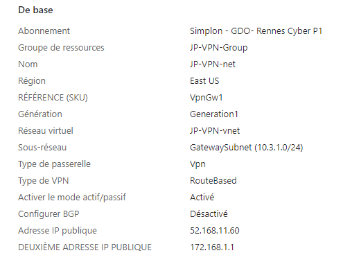
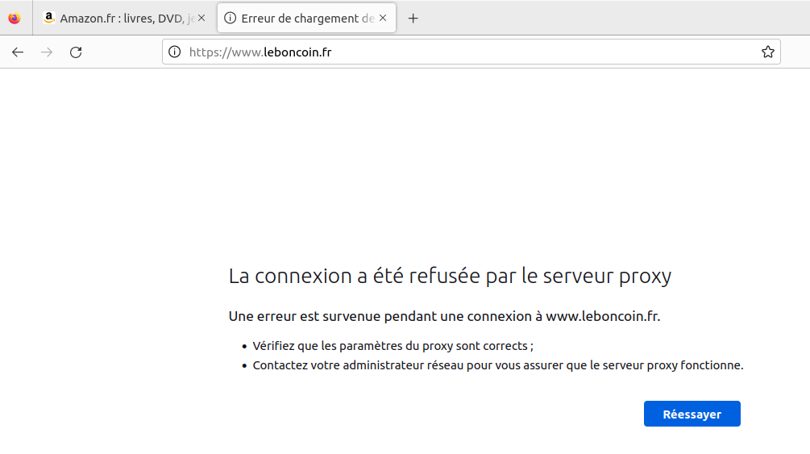

# MSCYBER#04 - Sécurité des accès distants sur les architectures hybrides  

En tant que administrateur Infrastructure Sécurisée, vous devez préparer un modèle de fichier de configuration pour sécuriser les connexions distantes sur les serveurs GNU/Linux de l'entreprise, qu'ils soient hébergés en propre par l'entreprise ou dans le cloud.

## Authors

Roblot Jean-Philippe - <jroblot.simplon@proton.me>  
Drula Kevin - <k.drula.simplon@proton.me>

## Version

18/01/2024 - V1R0

## Releases


</br>Powered by <https://shields.io>

# 1. PREPARATION

Installation d'une machine virtuelle Ubuntu Server via VirtualBox  
Carte réseau en mode Pont  
TCP/IP statique 10.0.5.10

**Machine serveur**

- GNU/Linux/UBUNTU Server LTS 22.04
- vCPU : 2 core
- vRAM 8Go
- vHDD : 40Go
- @ip : 10.0.5.1/24

**Machine client**

- Laptop Windows 10 Pro Version 22h2
- Nom : GDO-PC-PF1M1RXE
- CPU : 6 core
- RAM 32Go
- SSD : 512Go
- @ip : 10.0.5.10

# Activités

* Installer PFsense sur une machine physique via l'ISO officielle v2.7.2 depuis une clé USB bootable. Format de fichiers ZFS.
* Paramétrer les deux interfaces de la machine en leur attribuant une IP  
  ```bash
  WAN -> em0 -> v4: 192.168.1.105/24
  LAN -> bge0 -> v4: 10.0.5.254/24
  ```
* Connecter notre machine client en local via navigateur afin de bénéficier de la GUI
  
* Production d'un schéma logique du réseau sur Cisco Packet Tracer 

* Paramétrer une machine virtuelle Ubuntu Server avec connexion par pont afin de déployer notre  réseau local selon les contraintes  
  * Le routeur pfsense  
  * Un serveur Web
  * Une machine client W10 Pro  
* Vérifier le fonctionnement du serveur web sur le réseau local  
  * Ping du serveur depuis le client
    ```bash
    C:\Users\Utilisateur>ping 10.0.5.1

    Envoi d’une requête 'Ping'  10.0.5.1 avec 32 octets de données :
    Réponse de 10.0.5.1 : octets=32 temps<1ms TTL=64
    Réponse de 10.0.5.1 : octets=32 temps=1 ms TTL=64
    Réponse de 10.0.5.1 : octets=32 temps=1 ms TTL=64
    Réponse de 10.0.5.1 : octets=32 temps=1 ms TTL=64

    Statistiques Ping pour 10.0.5.1:
      Paquets : envoyés = 4, reçus = 4, perdus = 0 (perte 0%),
    Durée approximative des boucles en millisecondes :
      Minimum = 0ms, Maximum = 1ms, Moyenne = 0ms
    ```
  * Ping du routeur depuis le serveur ok  
* A ce stade, nôtre serveur  n'a pas la fonctionnalité serveur web, nous devons l'implémenter
  ```bash
  sudo apt install apache2

  sudo ufw app list # Affiche les profils d’application ufw disponibles
  ------------------------------------------------------------------------------
  # Sortie
  Available applications:
  Apache
  Apache Full
  Apache Secure
  ------------------------------------------------------------------------------
  sudo ufw allow 'Apache'
  # profil le plus restrictif qui permettra toujours le trafic que vous 
  # avez configuré, en autorisant le trafic sur le port 80 
  #(trafic web normal, non crypté)

  sudo ufw status # Vérifier notre config
  ------------------------------------------------------------------------------
  #Sortie
  Status: active

  To                         Action      From
  --                         ------      ----
  Apache                     ALLOW       Anywhere                  
  Apache (v6)                ALLOW       Anywhere (v6)
  ------------------------------------------------------------------------------

  sudo systemctl status apache2 # Vérifie que le service fonctionne

  http://your_server_ip # Affiche la page d'accueil
  ```
* Rendre le serveur web accessible au public  
A ce stade, notre page d'acceuil est uniquement accessible dans le LAN  
  * Paramétrer une redirection de port sur pfsense afin de permettre l'affichage de la page web depuis l'extérieur
  
* Paramétrer le NTP 
* Régler le fuseau horaire du routeur (System => General setup) 
* Dans l'optique de configurer un VPN afin de permettre aux collaborateurs de travailler à distance, nous devons effectuer plusieurs actions. Nous nous appuirons ici sur les recommandations de l'ANSSI pour les différentes configurations.
  * Créer une CA et son certificat
      
  * Générer un certificat pour le serveur VPN
  * Créer un utilisateur et son certificat
    
  * Créer notre serveur OpenVPN
    
  * Autoriser le traffic depuis le serveur VPN avec une règle de pare-feu
    
  * Créer une règle pour ouvrir le port de notre VPN sur notre interface WAN
    
  * Exporter la configuration serveur afin de renseigner le client OpenVPN  
    1 - Installer OpenVPN Client Export via Package Manager sur pfsense
      
    2 - Exporter la configuration
      
* Côté client distant, lancer le client OpenVPN et importer la configuration serveur
* Une fois la connexion établie, accéder à notre serveur web 10.0.5.1 via le navigateur
    