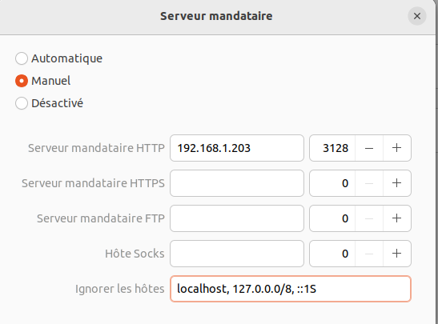
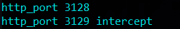

# MSCYBER#10 - Méthodologie ITIL

Mise en place d'une Méthodologie ITIL et d'un serveur GLPI

## Authors

Roblot Jean-Philippe - <jroblot.simplon@proton.me>

## Version

24/01/2024 - V1R0

## Releases


</br>Powered by <https://shields.io>

# 1. DOCUMENTATION

- C'est quoi ITIL 4 ?  

  **ITIL** (_Information Technology Infrastructure Library_) est un ensemble de compétences organisationnelles spécifiques qui visent à créer de la valeur pour les clients finaux sous forme de services.  
  ITIL était d'abord basé sur la standardisation des pratiques informatique (1990). ITIL 4 Est plus orienté vers la création de valeur.

- C'est quoi ITSM ?  

  **L'ITSM** (_Information Technology Service Management_), ou gestion des services informatiques, désigne simplement la manière dont les équipes informatiques gèrent la livraison de services informatiques de bout en bout aux clients. Elle comprend l'ensemble des processus et activités de conception, de création, de prestation et de support des services informatiques.

- Principes directeurs ITIL V4 :

  - Mettre le Focus sur la Valeur
  - Commencer là où vous êtes
  - Progresser Itérativement avec les Commentaires
  - Collaborer et promouvoir la Visibilité
  - Penser et travailler de manière holistique
  - Rester simple et pratique
  - Optimiser et Automatiser  
    => Détails : https://www.easyvista.com/fr/blog/itil-4-tout-savoir-sur-les-bonnes-pratiques-indispensables-pour-optimiser-votre-si

- Lexique :
  - **Le centre de services** (_CDS_) est une fonction (au sens « département de l’entreprise ») de service d'assistance informatique de la partie « Soutien des Services » des bonnes pratiques ITIL. Son objectif est de servir de guichet unique aux utilisateurs pour leurs besoins de services informatiques.
  - **Fonction** : référence à une unité organisationnelle spécialisée ou un groupe de personnes qui exécute des activités spécifiques au sein de la gestion des services informatiques.
  - **Les processus** sont ue suite d’activités coordonnées qui mettent en œuvre des ressources et aptitudes afin de délivrer un résultat à un client.
  - **Les rôles** (et responsabilités) permettent aux personnes
    de connaître les attentes, comme par exemple comment se
    comporter, ce qu’il faut accomplir et comment atteindre l’objectif.
    Une compréhension claire leur permet également de travailler
    ensemble avec moins de débats et plus de créativité.
  - **Le SLA** (_service-level agreement_) ou « accord de niveau de service » est un document qui définit la qualité de service, prestation prescrite entre un fournisseur de service et un client. Autrement dit, il s'agit de clauses basées sur un contrat définissant les objectifs précis attendus et le niveau de service que souhaite obtenir un client de la part du prestataire et fixe les responsabilités.
  - **Les KPI** (_key performance indicators_ ou indicateurs clés de performance) sont une mesure de la performance qui permet aux organisations d'obtenir des informations sur de nombreux facteurs pertinents tels que l'efficacité et l'efficience de leurs processus. La fonction principale des KPI est d'aider les entreprises à découvrir de meilleurs moyens de gérer et d'optimiser leurs opérations internes.
  - **La gestion des incidents** (_GDI_) est un processus de gestion du cycle de vie de tous les incidents. Elle s’assure que l'exploitation normale des services soit rétablie le plus rapidement possible et que l’impact sur le business soit réduit au minimum. La gestion des incidents est un processus inclus dans la démarche ITIL et ISO 20000.
  - **La gestion des problèmes** est l'un des 17 de la partie « Gestion des services » (Service management) d'ITIL v4. L'objectif de la gestion des problèmes est d'identifier les incidents récurrents, trouver une solution de contournement aux incidents et problèmes qui peuvent être résolus, ou minimiser l'impact de ceux qui ne peuvent pas l'être.
  - **La gestion de configuration** consiste à gérer la description technique d'un système1 (et de ses divers composants), ainsi qu'à gérer l'ensemble des modifications apportées au cours de l'évolution du système. En d'autres termes, il s'agit de l'ensemble des processus permettant d'assurer la conformité d'un produit aux exigences, tout au long de son cycle de vie. La gestion de configuration peut être utilisée à plusieurs fins :
    - Pour stocker et tracer les différentes versions ou révisions de toute information destinée à être utilisée par un système (matériel, logiciel, document, donnée unitaire, etc).
    - Pour déployer des configurations à travers un parc informatique sous forme de fichiers et données.
  - **Known Error** (_erreur connue_) : situation où la cause d'un incident a été identifiée et documentée, et une solution ou une contournement a été développé. Cette documentation permet de faciliter la résolution rapide des incidents similaires à l'avenir.
  - **Escalade** : Le processus de transfert d'un incident ou d'une demande de service à un niveau supérieur de support lorsque nécessaire.
  - **Base de connaissance** (_Knowledge Base_) : contient des informations, des solutions et des conseils pour résoudre des incidents et des problèmes courants.
  - **CMBD** (_base de données de gestion de configuration_) : référentiel qui sert d'entrepôt de données pour les installations IT. Il contient des données relatives à un ensemble des actifs IT (communément appelés éléments de configuration ou configuration items (CI)), ainsi que des relations descriptives entre ces actifs. Une CMDB fournit une vue organisée des données de configuration et un moyen d'examiner ces données à partir de n'importe quel point de vue.
  - **RFC** (_Request For Change_ ou demande de changement) : document formel utilisé pour proposer, évaluer et autoriser des changements dans l'environnement informatique. Il comporte 5 étapes :
    - La proposition de changement
    - L’évaluation et la planification du changement
    - Les approbations du changement
    - L’implémentation du changement
    - La revue post implémentation
  - **MOA** (maîtrise d'ouvrage):
    - _Acteurs_ :
      - Le métier (représentants des départements ou des utilisateurs finaux pour lesquels le projet est réalisé. Ils expriment leurs besoins et leurs attentes et définissent les objectifs métier)
      - le chef de projet MOA (s'assure que les besoins métier sont correctement compris et traduits en exigences pour la MOE.)
    - _Responsabilités_ :
      - Définir les besoins et les objectifs métier.
      - Valider la conformité des solutions aux attentes métier.
      - Arbitrer les priorités en cas de conflits.
      - Participer à la gestion du changement.
  - **MOE** (maîtrise d'oeuvre) :
    - _Acteurs_ : les développeurs, les testeurs, le chef de projet MOE
    - _Responsabilités_ :
      - Concevoir et développer la solution technique.
      - Assurer les tests unitaires et d'intégration.
      - Mettre en œuvre la solution conformément aux spécifications.
      - Assurer le support technique post-implémentation.
  - **Différence MOA / MOE** : la MOA représente les utilisateurs finaux et définit les besoins métier, tandis que la MOE met en œuvre les solutions techniques conformes à ces besoins.
  - **Modèle RACL** : structure de responsabilité qui aide à clarifier les rôles et responsabilités des différentes parties prenantes dans la réalisation d'une tâche, d'un projet ou d'un processus.
    - _Responsable_ (R - Responsible) : La personne ou le groupe chargé de la réalisation de la tâche ou de l'activité. Il peut y avoir plusieurs personnes responsables d'une tâche, mais une seule est généralement désignée comme responsable principal.
    - _Approbateur_ (A - Accountable) : La personne ou l'entité ultime qui doit rendre compte du résultat de la tâche. Il n'y a normalement qu'une seule personne ou entité responsable au niveau le plus élevé.
    - _Consulté_ (C - Consulted) : Les personnes ou groupes qui fournissent des informations ou des conseils avant ou pendant la réalisation de la tâche.
    - _Informé_ (I - Informed) : Les personnes ou groupes qui doivent être tenus informés des progrès ou des résultats de la tâche, mais qui n'ont pas nécessairement un rôle actif dans sa réalisation.
  - **Etapes de mise en oeuvre du modèle RACL**
    - _Identification des Tâches ou Activités_ : Identifiez clairement les tâches, les activités ou les processus pour lesquels vous souhaitez établir un modèle RACI.
    - _Liste des Parties Prenantes_ : Identifiez toutes les parties prenantes impliquées dans chaque tâche ou activité.
    - _Définition des Rôles_ : Déterminez qui sera responsable, qui sera approuvant, qui sera consulté, et qui sera informé pour chaque tâche.
    - _Création du Tableau RACI_ : Construisez un tableau RACI pour chaque tâche, avec les parties prenantes répertoriées dans les colonnes, et les tâches répertoriées dans les lignes.
    - _Communication et Validation_ : Partagez le modèle RACI avec toutes les parties prenantes concernées.
    - _Intégration dans la Gestion des Projets ou Processus_ : Intégrez le modèle RACI dans vos pratiques de gestion de projet ou de processus.
    - _Révision et Mise à Jour_ : Périodiquement, révisez et mettez à jour le modèle RACI en fonction des changements dans les équipes, les projets ou les processus.
  - **l'automatisation des services de gestion des incidents** apporte des gains d'efficacité, de rapidité et de fiabilité, contribuant ainsi à une gestion plus efficace des opérations informatiques. Cela permet également aux équipes de se concentrer sur des activités plus stratégiques et à forte valeur ajoutée.
  - **Le cycle de vie des services** dans ITIL (Information Technology Infrastructure Library) est une approche qui divise la gestion des services informatiques en différentes phases, de la conception à la mise hors service. Ces phases sont structurées pour aider les organisations à planifier, fournir et améliorer continuellement leurs services informatiques. Les cinq phases du cycle de vie des services ITIL sont les suivantes :

    * ***Stratégie des Services*** (Service Strategy) :  
      *Objectif* : Définir la stratégie globale des services en alignement avec les *objectif*s de l'entreprise.  
      *Activités Clés* : Identification des besoins des clients, développement de la stratégie des services, définition des portefeuilles de services, gestion des actifs et des finances.  
    
    * ***Conception des Services*** (Service Design) :  
      *Objectif* : Transformer la stratégie des services en plans concrets pour le développement de services.  
      **Activités Clés** : Conception de la solution, gestion de la capacité, gestion de la disponibilité, gestion de la continuité des services, gestion de la sécurité de l'information, et gestion des fournisseurs.

    * ***Transition des Services*** (Service Transition) :  
      *Objectif* : Mettre en œuvre les services nouvellement conçus ou modifiés dans l'environnement de production.  
      *Activités Clés* : Planification et coordination de la transition, gestion des changements, gestion des versions, gestion des déploiements, gestion de la connaissance.

    * ***Exploitation des Services*** (Service Operation) :  
      *Objectif* : Assurer le bon fonctionnement des services en production et gérer les incidents, les problèmes, les demandes et les événements.  
      *Activités Clés* : Gestion des incidents, gestion des problèmes, gestion des demandes de service, gestion des événements, gestion des opérations informatiques.

    * ***Amélioration Continue des Services*** (Continual Service Improvement) :  
      *Objectif* : Améliorer continuellement la qualité des services et l'efficacité des processus.  
      *Activités Clés* : Identification des opportunités d'amélioration, mesure et collecte de données, définition d'indicateurs de performance, mise en œuvre de changements, évaluation des résultats.

# 2. PREPARATION

Installation d'une machine virtuelle Ubuntu Server via VirtualBox  
Carte réseau en mode Pont  
Préparation des dépendances  
Installation GLPI

**Machine serveur**

- GNU/Linux/UBUNTU Server LTS 22.04
- vCPU : 2 core
- vRAM 8Go
- vHDD : 40Go
- @ip : 192.168.1.200/24
- Port SSH : 22

**Machine client**

- Laptop Windows 10 Pro Version 22h2
- Nom : GDO-PC-PF1M1RXE
- CPU : 6 core
- RAM 32Go
- SSD : 512Go
- Putty - OpenSSH

# 3. DEPLOIEMENT

- Lancer son serveur Ubuntu et le mettre à jour
```bash
sudo apt update && apt upgrade
```
- Installer MariaDB
```bash
sudo apt install mariadb-server
sudo mysql_secure_installation
```
Créer une DB et un utilisateur pour GLPI
``` 
$ sudo mysql -u root -p 

CREATE DATABASE glpi;
CREATE USER 'glpi_adm'@'localhost' IDENTIFIED BY 'StrongDBPassword';
GRANT ALL PRIVILEGES ON glpi.* TO 'glpi_adm'@'localhost';
FLUSH PRIVILEGES;
EXIT;
```
- Installer PHP et ses dépendances, ainsi que Apache2 et son module PHP afin d'accéder à l'interface web de GLPI
```bash
sudo apt install php php-{curl,zip,bz2,gd,imagick,intl,apcu,memcache,imap,mysql,cas,ldap,tidy,pear,xmlrpc,pspell,mbstring,json,iconv,xml,gd,xsl}

sudo apt install apache2 libapache2-mod-php
```
- Protéger les cookies de GLPI  
```bash
$ sudo nano /etc/php/*/apache2/php.ini
session.cookie_httponly = on
```
- Télécharger la dernière version et la décompresser
```bash
# Créer une variable qui permettra de télécharger automatiquement la dernière version de GLPI
VER=$(curl -s https://api.github.com/repos/glpi-project/glpi/releases/latest|grep tag_name|cut -d '"' -f 4)

wget https://github.com/glpi-project/glpi/releases/download/$VER/glpi-$VER.tgz

# Décompresser l'archive
tar xvf glpi-$VER.tgz
```
- Déplacer le dossier GLPI vers ` /var/www/html`
- Donner les autorisation à Apache sur le répertoire
```bash
sudo chown -R www-data:www-data /var/www/html/
```
Notre serveur GLPI est maintenant paramétré, nous allons pouvoir accéder à son interface graphique via le navigateur.

# Utilisation GLPI

Se rendre sur notre serveur via l'URL, ici <Mark>192.168.1.200/glpi</Mark>
1. Installer GLPI
  
  
  1.1. Connecter la DB
    
    Valider les étapes suivantes
    
2. Se connecter à GLPI
  
  
3. Inventorier nos actifs :
  
4. Créer un utilisateur Formateur et lui attribuer un écran et un laptop
  
  
5. Se connecter avec l'utilisateur Formateur et ouvrir un ticket
  
  
  
