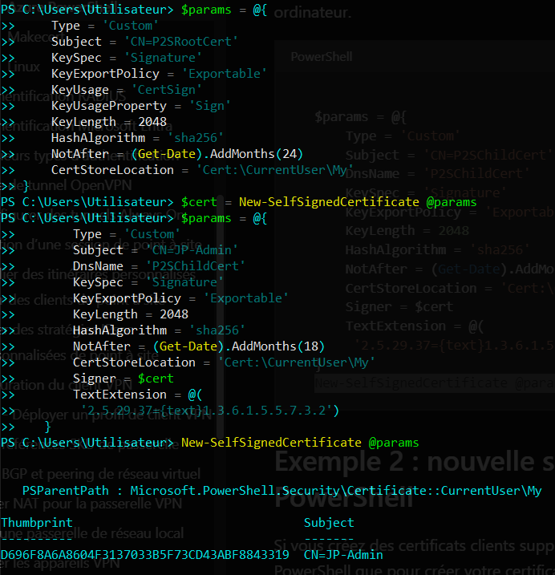
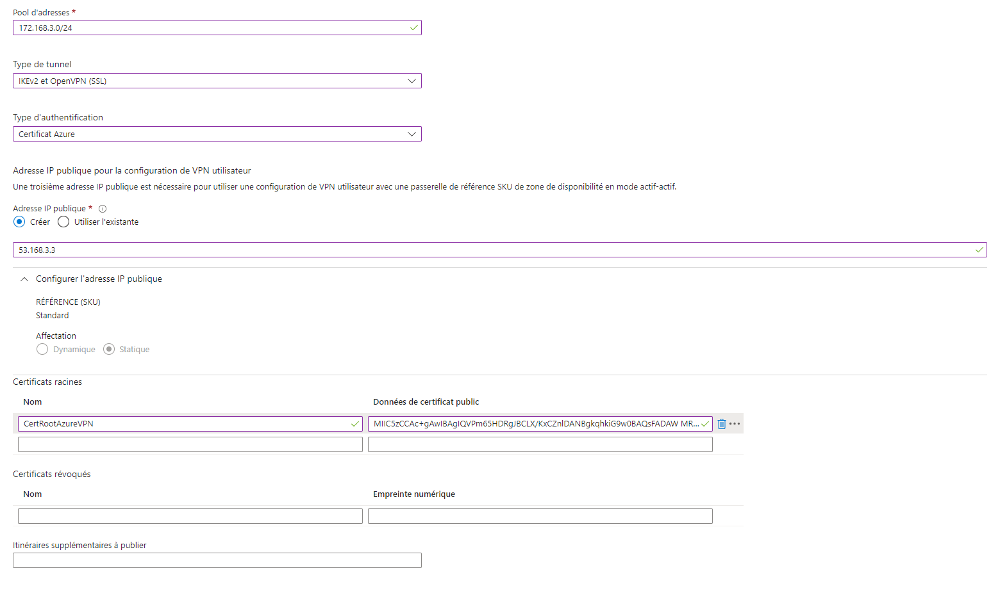
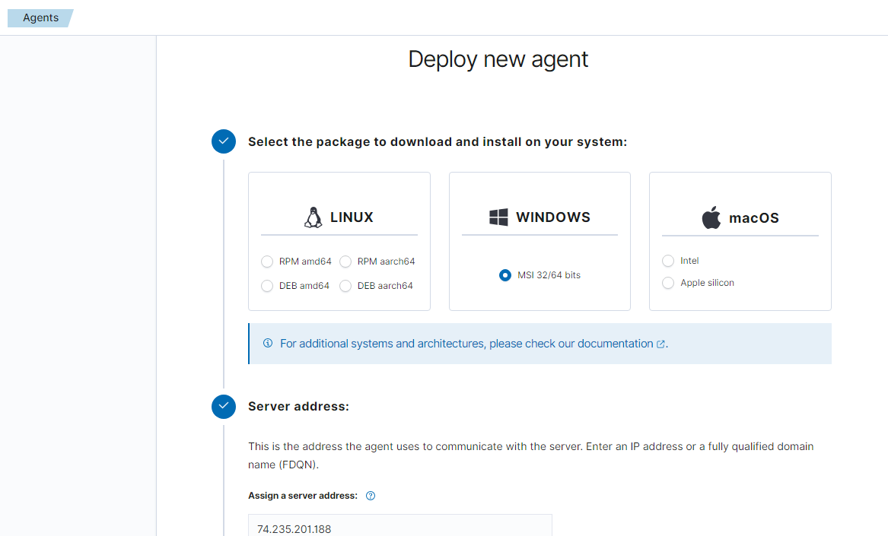
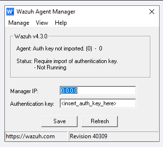

# MSCYBER#13 - Utilisation des conteneurs Docker

En tant qu'administrateur infrastructure et sécurité, vous devez vous familiariser avec la technologie des conteneurs pour partager vos connaissances avec les collaborateurs de la DSI afin de permettre le passage à cette technologie dans l'entreprise.

## Authors

Roblot Jean-Philippe - <jroblot.simplon@proton.me>

## Version

31/01/2024 - V1R0

## Releases


</br>Powered by <https://shields.io>

## Prérequis

**Machine serveur**

* VPS accessible via SSH sur l'ip 192.168.1.201 sur le port TCP/22 et le compte (simplon/simplon)
*  Le VPS dispose d'une pré-installation de l'outil DOCKER
* Vous devez modifier la configuration pour passer sur le port 666, interdire l'utilisation de mots de passe pour la connexion SSH et utiliser uniquement des clés SSH-RSA

**Machine client**

- Laptop Windows 10 Pro Version 22h2
- Nom : GDO-PC-PF1M1RXE
- CPU : 6 core
- RAM 32Go
- SSD : 512Go
- Putty - OpenSSH

## Configuration du serveur
* Générer une paire de clés côté client : 
`ssh-keygen -t rsa`

* Copier la clé publique sur le serveur

  ```bash
  cat ~/.ssh/id_rsa.pub | ssh user@server "mkdir -p ~/.ssh && cat >> ~/.ssh/authorized_keys"
  ```

* Modifier la configuration d' OpenSSH sur le serveur
  
  

* Se reconnecter au serveur en spécifiant notre id à la première connexion  
`ssh simplon@192.168.1.201 -i id_rsa`

# 1. Exploration des conteneurs

1. Vérifier l'installation et la version de docker disponible sur la plateforme  
  Basiquement :  
    ```bash
      docker -v

      # Sortie
      Docker version 25.0.1, build 29cf629
    ```   
    De façon détaillée :  
    ```bash
      docker info # Donne les info détaillée de Docker
    ```
    Cette commande permet de répondre aux questions 2 et 3 également

2. Lister les conteneurs éventuellement en cours d'exécution ou à l'arrêt
    ```bash
      #Via docker info
      Server:
      Containers: 1
      Running: 0
      Paused: 0
      Stopped: 1

      # Lister les containers en cours d'execution
      Docker ps
    
      # Lister tous les containers
      docker ps --all
    ```

3. Lister les images de conteneurs déjà disponibles dans l'environnement
    ```bash
      # Via docker info
      Images: 1

      # Plus spécifiquement
      docker images
     ```

4. Où se trouve le registre d'images par défaut de la configuration ?  
  Sur un système Linux, l'enplacement par défaut est `/var/lib/docker/`.
  A titre information, voici les chemin sur Windows et MacOS :
    ```
      C:\ProgramData\Docker\Desktop

      ~/Library/Containers/com.docker.docker/Data/vms/0/
    ```

5. Quel est le répertoire de travail par défaut de docker dans l'environnement ?  
    Paramétrable dans le Dockerfile via l'instruction `WORKDIR`, la valeur prise par défaut est `/`

6. Sur quel port Docker publie sont API de commande à distance ? Le port 2375
    ```bash
      # via docker info
      WARNING: API is accessible on http://0.0.0.0:2375 without encryption.
         Access to the remote API is equivalent to root access on the host. Refer
         to the 'Docker daemon attack surface' section in the documentation for
         more information: https://docs.docker.com/go/attack-surface/
    ```

7. Quels composants docker permet-il de manipuler ?  
    Nous pouvons manipuler des images, des conteneurs, du réseau et le stockage.  
    Ressource pour l'architecture Docker : [Architecture of Docker](https://www.geeksforgeeks.org/architecture-of-docker/)

8. A quoi sert le Docker Hub ? Trouver l'image NGINX officiel sur le site en question  
    C'est un registre officiel permettant de gérer et partager des images open source ou propriétaire : [Docker Hub](https://hub.docker.com/).  
    *Image Nginx officielle :*

    

9. Lancer un premier conteneur en utilisant l'image de base NGINX et en exposant le site par défaut sur le port TCP/8080  
    ```bash
      # Rechercher l'image officielle via le terminal 
      $ docker search nginx
      NAME                               DESCRIPTION                                     STARS     OFFICIAL   AUTOMATED
      nginx                              Official build of Nginx.                        19555     [OK]

      # Télécharger l'image
      $ docker pull nginx
      Using default tag: latest
      latest: Pulling from library/nginx

      # Lancer le conteneur Nginx en ouvrant le port 8080
       docker run -p 8080:80 -d nginx # le paramètre -d permet de lancer le conteneur en tache de fond et de garder la main sur notre terminal
    ```
    
  
10. Avez-vous pensé à utiliser le mode "détaché" pour lancer votre conteneur ? C'est utile ... ou pas ?  
(cf paramètre `-d` ci dessus). Si on ne lance pas en mode détaché, le conteneur se lance en premier plan et nous n'avons plus la main sur notre Docker.

11. Ouvrir une console terminal interactive sur le conteneur NGINX pour inspecter son contenu  
`sudo docker inspect nginx | less`

12. Arrêter votre conteneur NGINX
  ```bash
    # Identifier notre conteneur via son id ou nom
    $ docker ps
    CONTAINER ID   IMAGE     COMMAND                  CREATED         STATUS         PORTS                  NAMES
    b8fab17e39ee   nginx     "/docker-entrypoint.…"   7 minutes ago   Up 7 minutes   0.0.0.0:8080->80/tcp   peaceful_payne

    # Arrêter le conteneur
    $ docker stop b8fab17e39ee
  ```

13. Afficher la liste des conteneurs terminés
  ```bash
    $ docker ps -a --filter "status=exited"
    CONTAINER ID   IMAGE     COMMAND                  CREATED          STATUS                      PORTS     NAMES
    b8fab17e39ee   nginx     "/docker-entrypoint.…"   25 minutes ago   Exited (0) 17 minutes ago             peaceful_payne
  ```
14. Supprimer manuellement votre conteneur et vérifier la liste des conteneurs disponibles
  ```bash
    $ docker rm b8fab17e39ee

    $ docker ps -a
    CONTAINER ID   IMAGE     COMMAND   CREATED   STATUS    PORTS     NAMES
  ```
15. Lancer trois conteneurs NGINX en exposant chaque conteneur sur un port différent : 8080, 8081 et 8082
  ```bash
    $ docker run -p 8080:80 -d nginx
    $ docker run -p 8081:80 -d nginx
    $ docker run -p 8082:80 -d nginx
  ```
  
16. Vérifier l'accès à vos conteneurs depuis votre navigateur
  
  
17. Arrêter tous les conteneurs NGINX
    ```bash
      $ docker stop $(docker ps -q)
      c163ac49bb57
      6be1fd1f4638
      63f7aa943292
    ```

18. Supprimer manuellement tous les conteneurs terminés en une seule commande  
  `$ docker rm $(docker ps -a -q -f status=exited)`

19. Lister les images disponibles sur votre VM

20. Inspecter le contenu (les couches) de l'image NGNIX disponible sur votre VM

21. Quelle est la différence entre une image et un conteneur ?  
    Une image Docker est un modèle en lecture seule, utiliser pour créer des conteneurs Docker. Elle est composée de plusieurs couches empaquetant toutes les installations, dépendances, bibliothèques, processus et codes d’application nécessaires pour un environnement de conteneur pleinement opérationnel.

22. A quoi sert un fichier Dockerfile ?
    Chaque conteneur Docker débute avec un ” Dockerfile “. Il s’agit d’un fichier texte rédigé dans une syntaxe compréhensible, comportant les instructions de création d’une image Docker.  
    Un Dockerfile précise le système d’exploitation sur lequel sera basé le conteneur, et les langages, variables environnementales, emplacements de fichiers, ports réseaux et autres composants requis.

# 2. Ma première application
  Suivre les instructions suivantes pour mettre en ligne votre première application web avec des conteneurs.  

  * Ouvrir une instance dans le PLAYGROUND DOCKER  
    Créer un répertoire de travail  
      ```bash 
        $ mkdir my-webapp
        $ cd my-webapp
      ``` 

  * Télécharger une application web Java
      $ wget https://tomcat.apache.org/tomcat-8.0-doc/appdev/sample/sample.war

    

  * Créer & éditer le contenu du fichier Dockerfile
    ```
    $ touch Dockerfile
    $ nano Dockerfile
    FROM tomcat:8.0-alpine
    ADD sample.war /usr/local/tomcat/webapps
    EXPOSE 8080
    CMD ["catalina.sh", "run"]
    ```
    y

  * Créer une image locale de votre application
    ```
    $ docker build –t my-webapp:v1 
    ```

  * Exécuter un conteneur à partir de votre image
    ```
    $ docker run –p 80:8080 my-webapp:v1
    ```

  * Vérifier en cliquant sur le lien « OPEN PORT - 80 » dans le DOCKER PLAYGROUND
  Ajouter le chemin "/sample/" dans l’url de la page pour voir le HELLO WORLD ... OU PAS !?
  
  

# 3. Travailler avec plusieurs conteneurs  

  * Ouvrir une instance dans le PLAYGROUND DOCKER
  Récupérer les images
    ```
    $ docker image pull redis:alpine
    $ docker image pull russmckendrick/moby-counter
    ```

  * Créer le réseau & Analyser les différences l’hôte
    ```
    $ ip a | tee /tmp/netinf.old
    $ docker network create net-moby
    $ ip a | tee /tmp/netint.new
    $ diff /tmp/netinf.old /tmp/netint.new
    ```
     La commande `tee` lit à partir de l’entrée standard et écrit à la fois dans le fichier spécifié et dans la sortie standard
    
    
    

  * Lancer les conteneurs et les connecter au réseau
    ```
    $ docker run –d --name redis --network net-moby redis:alpine
    $ docker run -d --name moby01 --network net-moby -p 80:80 russmckendrick/moby-counter
    ```

  * Compléter pour inspecter la configuration réseau
  `$ docker network ?`   
  `docker network inspect net-moby`

  * Compléter pour afficher et analyser `/etc/hosts`
    ```bash
      $ cat /etc/hosts
      127.0.0.1       localhost # IP du réseau local de nos conteneur

      fe00::0 ip6-localnet
      ff00::0 ip6-mcastprefix
      ff02::1 ip6-allnodes
      ff02::2 ip6-allrouters
      192.168.0.8     node1 # IP de notre instance Docker
      
    ```

  * Compléter pour afficher et analyser `/etc/resolv.conf`
    ```bash
      $ cat /etc/resolv.conf
      search 51ur3jppi0eupdptvsj42kdvgc.bx.internal.cloudapp.net
      nameserver 127.0.0.11 #La commande nous permet de récupérer l'ip du DNS
      options ndots:0
    ```

  * Compléter pour tester la configuration de chaque conteneur
  `$ docker exec ?`
    ```bash
        $ docker exec -it redis cat /etc/hosts
        127.0.0.1       localhost
        ::1     localhost ip6-localhost ip6-loopback
        fe00::0 ip6-localnet
        ff00::0 ip6-mcastprefix
        ff02::1 ip6-allnodes
        ff02::2 ip6-allrouters
        172.19.0.2      a9f548e3a542 # IP du conteneur 'redis'
    ```

  * Vérifier la configuration, interroger le serveur DNS du réseau
    ```bash
    $ docker exec moby01 nslookup redis 127.0.0.11

    # Sortie
    Server:    127.0.0.11
    Address 1: 127.0.0.11

    Name:      redis
    Address 1: 172.19.0.2 redis.net-moby
    ```

# 4. Utiliser le stockage avec un conteneur

  * Lancer un conteneur en partageant un dossier hôte  
      `$ docker run -it –v /tmp/data:/data ubuntu /bin/bash`
      ```bash
      #Sortie
        Unable to find image 'ubuntu:latest' locally
        latest: Pulling from library/ubuntu
        29202e855b20: Pull complete
        Digest: sha256:e6173d4dc55e76b87c4af8db8821b1feae4146dd47341e4d431118c7dd060a74
        Status: Downloaded newer image for ubuntu:latest
        root@a68bc6eb1270:/#
      ```

  * Créer un fichier depuis le terminal du conteneur
    ```bash
      root@containerID:/# cd /data
      root@containerID:/# touch testfile
      root@containerID:/# exit
    ```

  * Vérifier la création du fichier dans le dossier hôte  
    `$ ls –hal /tmp/data`
    ```bash
      $ ls –hal /tmp/data
      ls: –hal: No such file or directory
      /tmp/data:
      testfile
    ```

**Question** = Que se passe-t-il si un fichier partagé est modifié simultanément par un processus du conteneur et un processus de l’hôte ?  
*Dans Docker, si un fichier partagé est modifié simultanément par un processus du conteneur et un processus de l’hôte, cela peut entraîner une condition de concurrence.  
En général, le système de fichiers ne garantit pas quelles modifications seront préservées.*

  * Démarrer une nouvelle application MOBY-COUNTER
    ```bash
      $ docker network create net-moby
      $ docker run –d --name redis --network net-moby redis:alpine
      $ docker run –d --name moby01 --network net-moby -p 80:80 russmckendrick/moby-counter
    ```

  * Visiter l’application moby-counter et créer un beau dessin  

    

  * Supprimer le conteneur redis  
    `$ docker stop redis && docker rm redis`

  * Visiter l’application ainsi déconnecter du backend  
    *L'apllication ne fonctionne plus*  
    
  * Créer un conteneur redis en attachant le volume « caché »  
    `$ docker container run –d --name redis -v <volume_id>:/data --network net-moby redis:alpine`
    ```bash
      $ docker volume ls -q
      76b62abc64803215d77df8a01db77f4f998801eee990163ab7e5c15a816bf5d2
      [node1] (local) root@192.168.0.8 ~
      $ docker container run -d --name redis -v 76b62abc64803215d77df8a01db77f4f998801eee990163ab7e5c15a816bf5d2:/data --network net-moby redis:alpine
      20ea5a20dcffec9053a5e6f9c1c4bc122460558c79ba6841a9170806a29a07d0
    ```

  * Visiter l’application et retrouver votre beau dessin ... ou pas => et bah si ! 

  * Compléter la commande et afficher le contenu du volume  
    `$ docker exec ?`
    ```bash
      $ docker exec redis ls /data
      dump.rdb
    ```