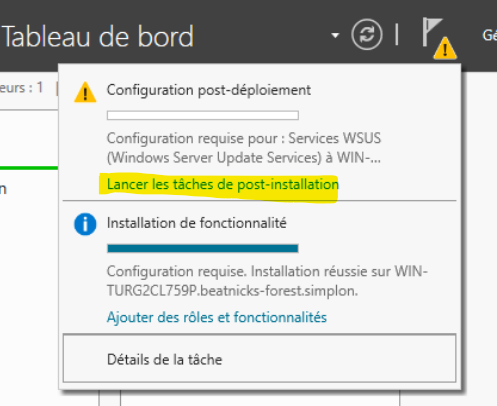

# Mise en place d'un serveur WSUS

Votre entreprise dispose d'un domaine AD pour la gestion du parc informatique. Pour renforcer la sécurité des postes et optimiser la bande passante Internet, vous devez déployer un serveur WSUS et sélectionner le mode de mise à jour et les mises à jours à appliquer.

## Authors

Roblot Jean-Philippe - <jroblot.simplon@proton.me>  
Drula Kevin - <kdrula.simplon@proton.me>

## Version

06/02/2024 - V1R0

## Releases

 Powered by <https://shields.io>

## Contexte

En tant que administrateur Système, mise en place d'un serveur AD et un serveur WSUS

RAPPEL sur la mise en oeuvre d'un domaine AD et l'intégration d'un poste client au domaine Mise en oeuvre d'un rôle sur un serveur MS Windows Configuration du rôle et application des règles de mises à jour selon les préconisations de l'ANSSI

Vous devez installer et configurer un serveur MS Windows 2019 en tant que contrôleur de domaine et installer un serveur de mises à jour avec le servive WSUS sur un second serveur.

Rédigez et validez la procédure d'installation du serveur WSUS et la configuration des mises à jour.

## Prérequis

**Machine serveur 1**

- Windows server 2019
- vCPU : 1 core
- vRAM 6Go
- vHDD : 50Go
- NIC en mode pont
- @ip : 192.168.1.203/24
- Rôle ADDS contrôleur de domaine
-Rôle DNS
-Rôle DHCP - Plage @ip 192.168.1.204-205

**Machine serveur 2**

- Windows server 2019
- vCPU : 1 core
- vRAM 6Go
- vHDD : 50Go
- NIC en mode pont
- @ip : 192.168.1.205/24
- Rôle WSUS

# Mise en place de WSUS

### Suivre l'assistant d'installation

  Choisir de stocker les updates sur une partition séparée du sytème

  Une fois le rôle installé, lancer les tâche post-installation (incluant notamment la création de la BDD) 

### Configuration de WSUS  

Sélectionner les produit souhaités dans le catalogue (/!\ aux options, le volume peut-être conséquent)

Définir l'automatisation des synchronisations et leur plannification

Lancer la synchronisation initiale 

# Serveur ADDS

* Ajouter le serveur WSUS à l' AD

  

* Paramétrer les GPO machines sur notre ADDS afin de lier nos machines clients à notre WSUS. On ouvre la console "Gestion de stratégie de groupe" et on créé une GPO liée sur la racine du domaine pour gérer l'intégralité des machines du domaine avec notre serveur WSUS.  
Modifier la GPO et parcourir les paramètres **"Configuration ordinateur > Stratégies > Modèles d’administration > Composants Windows > Windows Update"**  

  * « Spécifier l’emplacement intranet du service de mise à jour Microsoft »  
  

  *  « Configuration du service Mises à jour automatique »
  

  * « Ne pas se connecter à des emplacements Internet Windows Update »
  

  Résumé de la GPO
  

  *Note : pour utiliser WSUS uniquement sur certaines machines, appliquer un filtrage de sécurité sur un groupe de sécurité spécifique ou liez la GPO uniquement sur certaines OUs.*

  Pour tester la GPO, on va vérifier si le client est visible sur WSUS

  

### Gestion des Mise à jour et ordinateurs sur WSUS

Dans la liste de toutes les maj, on va filtrer  « Approbation : non approuvées » et  « État : Échec ou nécessaires »

Il s'agit ensuite d'approuver les maj que l'on souhaite déployer (en environnement de test)

**Voir les maj installées par le client**

