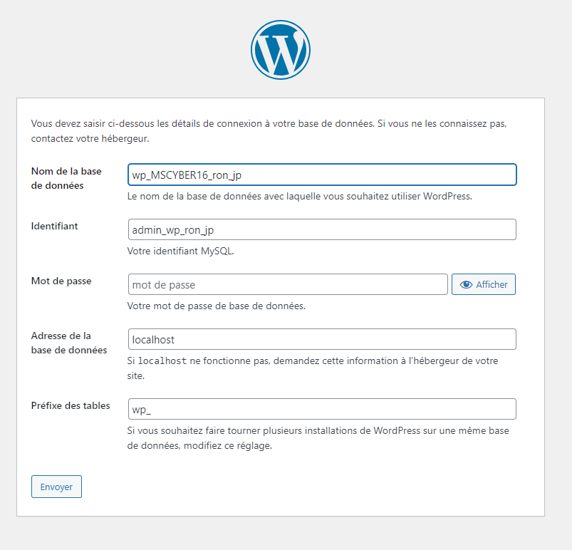
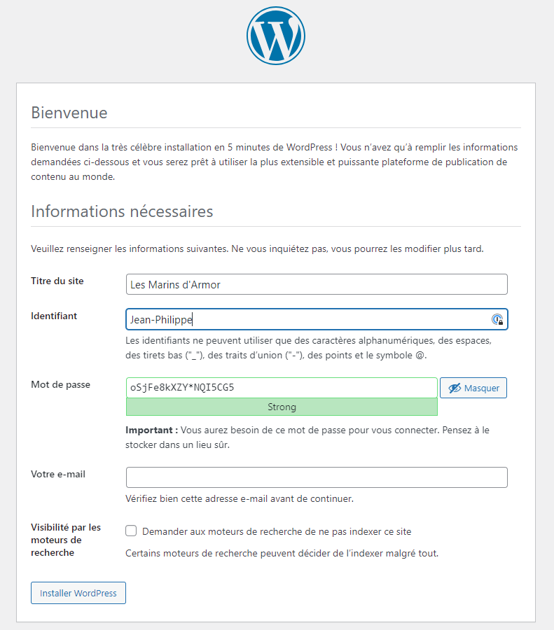
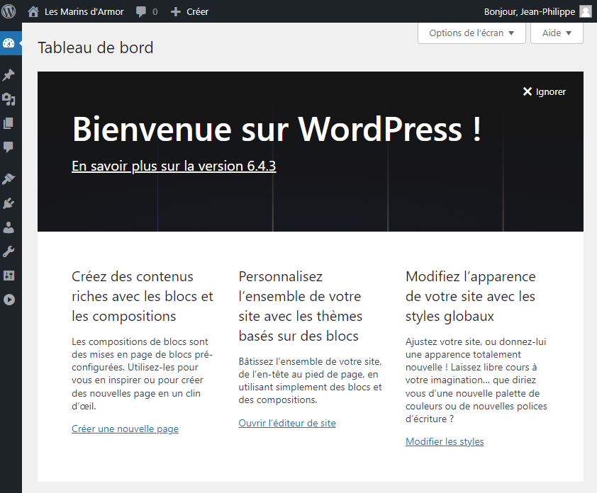
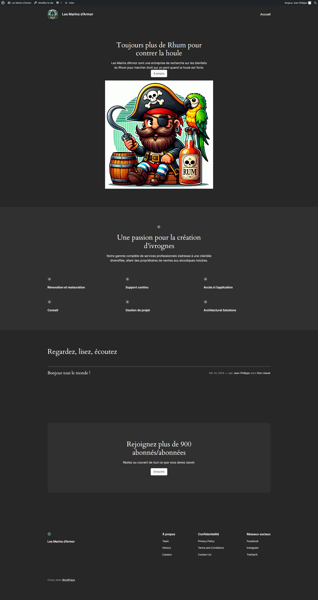
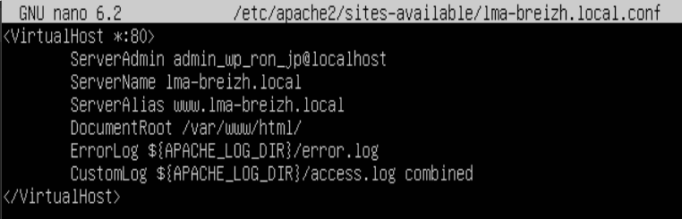
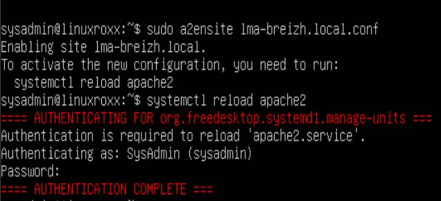
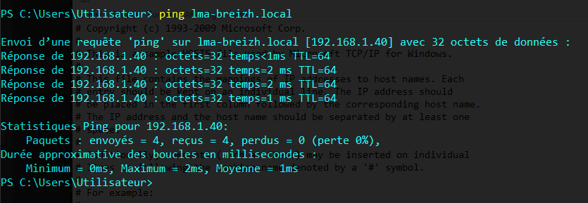
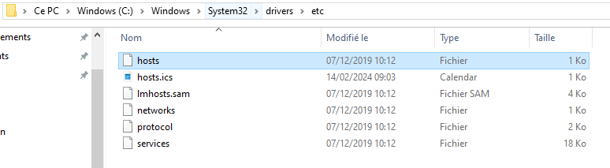
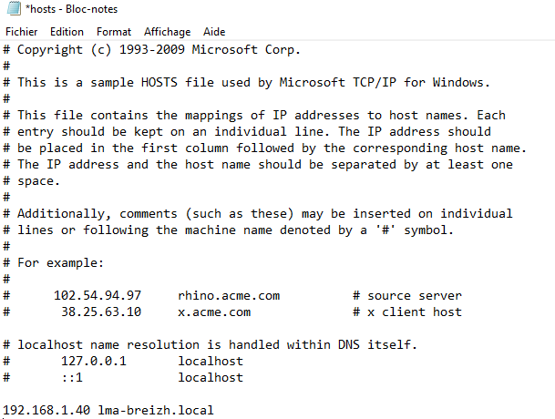

# Mise en place d'un Intranet pour chaque Filiale

En tant que administrateur Système, installation d'un serveur LAMP et de Wordpress

## Authors

Roblot Jean-Philippe - <jroblot.simplon@proton.me>  
Moreau Ronan - <rmoreau.simplon@proton.me>

## Version

15/02/2024 - V1R0

## Releases


</br>Powered by <https://shields.io>

## Contexte

Il est nécessaire de pouvoir communiquer a tout le monde au sein de la filiale afin de partager les informations importantes de l'entreprise.  
Les e-mails ne permettant pas d'avoir un historique pertinant, il a été choisit de procéder a la mise en place d'un Intranet.

## Questions

- Quelles sont les étapes principales pour installer un serveur LAMP sur un système Linux ?  
  Pour installer un serveur LAMP (Linux, Apache, MySQL, PHP) sur un système Linux, vous pouvez suivre les étapes suivantes :  
   Mise à jour du système :

  ```bash
    apt-get update
  ```

  Installation d’Apache :

  ```Bash
    apt-get install apache2 libapache-mod-php
  ```

  Après l’installation, le serveur Apache démarre directement. Vous devriez pouvoir accéder à sa page par défaut en utilisant l’adresse IP de votre serveur.

  Installation de MySQL :

  ```Bash
    apt-get install mariadb-server
  ```

  Pendant l’installation, entrer un mot de passe pour le compte d’administration de MySQL.

  Installation de PHP :

  ```Bash
    apt-get install php
  ```

  Installation des modules PHP

  ```Bash
    sudo apt install php-curl php-gd php-intl php-json php-mbstring php-xml php-zip php-mysql
  ```

  Redémarrage du serveur Apache : Après l’installation d’une extension sur votre serveur LAMP, pensez à redémarrer le service Apache

  ```bash
    service apache2 restart
  ```

- Quelles distributions Linux sont compatibles avec un serveur LAMP ?
  Un serveur LAMP peut être installé sur la plupart des distributions Linux.

- Quel est le rôle d'Apache dans un serveur LAMP et comment configurer un site web virtuel avec Apache ?
  Apache joue le rôle de serveur web dans une pile LAMP (Linux, Apache, MySQL, PHP). Il gère la communication entre le serveur et les clients.

- Comment installer et configurer MySQL pour fonctionner avec un serveur LAMP ?
- Quelles sont les bonnes pratiques pour sécuriser une base de données MySQL sur un serveur LAMP ?

  ```bash
    sudo mysql_secure_installation # Sécurise l'installation de MySQL, suivre les instructions

    sudo mysql -u root -p # se connecter à la DB

    # Créer une DB et un utilisateur
    CREATE DATABASE ma_base_de_donnees;
    CREATE USER 'mon_utilisateur'@'localhost' IDENTIFIED BY 'mon_mot_de_passe';
    GRANT ALL PRIVILEGES ON ma_base_de_donnees.* TO 'mon_utilisateur'@'localhost';
    FLUSH PRIVILEGES;

  ```

- Quelle version de PHP est recommandée pour un serveur LAMP et comment installer les extensions PHP nécessaires ?  
  La version 7.4, cf question 1 pour les modules

- Quels sont les outils de surveillance et de gestion disponibles pour superviser un serveur LAMP en production ?

  - ManageEngine OpManager1 : C’est un outil proactif de surveillance des serveurs qui aide les organisations à surveiller et à gérer leurs serveurs de manière transparente.
  - Site24x71 : Il offre une planification de la maintenance et des rapports personnalisables.
  - Moniteur de serveur et d’application1 : Il offre une interface Web intégrée unique et une cartographie intelligente des dépendances infra des applications.
  - Nagios3 : C’est un outil open source largement utilisé pour surveiller les performances de serveur et de réseau.

- Quelles sont les étapes pour déployer une application web sur un serveur LAMP et assurer sa disponibilité et sa stabilité ?

  - Installation du serveur LAMP.
  - Déploiement de l’application : Transférez les fichiers de votre application web sur le serveur. Assurez-vous que les fichiers sont dans le répertoire correct pour qu’Apache puisse les servir.
  - Configuration de la base de données : Créez une nouvelle base de données MySQL pour votre application.
  - Test de l’application : À ce stade, votre application devrait être accessible via un navigateur web.
  - Surveillance du serveur : Utilisez des outils de surveillance pour garder un œil sur l’utilisation du CPU, de la mémoire, de l’espace disque, etc.
  - Mise en place de sauvegardes : Configurez des sauvegardes régulières de votre base de données et de vos fichiers d’application. Cela vous permettra de récupérer rapidement en cas de perte de données.
  - Mise à jour régulière : Assurez-vous que votre serveur et votre application sont régulièrement mis à jour avec les derniers correctifs de sécurité.
  - Équilibrage de charge : Si votre application reçoit beaucoup de trafic, vous voudrez peut-être envisager de mettre en place un équilibrage de charge pour répartir le trafic entre plusieurs serveurs.
  - Plan de reprise après sinistre : Ayez un plan en place pour savoir comment vous récupérerez si quelque chose va mal. Cela pourrait inclure la bascule vers un serveur de secours, la restauration à partir de sauvegardes, etc.

- Quels sont les fichiers de configuration clés d'un serveur LAMP et où sont-ils situés sur un système Linux ?

  - Apache :
    _Configuration principale_ : `/etc/apache2/apache2.conf`  
    _Configuration du Virtual Host_ : `/etc/apache2/sites-available/000-default.conf` pour le site par défaut, et `/etc/apache2/sites-available/monsite.com.conf` pour un site spécifique.  
    _Configuration du module_ : `/etc/apache2/mods-available/`
  - MySQL :
    _Configuration principale_ : `/etc/mysql/my.cnf ou /etc/my.cnf`
  - PHP :
    _Configuration principale_ : `/etc/php/7.4/apache2/php.ini` pour PHP 7.4 avec Apache. Le chemin peut varier en fonction de la version de PHP et du serveur web utilisé.
  - Linux :
    _Configuration réseau_ : `/etc/network/interfaces ou /etc/netplan/` pour les systèmes utilisant Netplan.
    _Configuration du pare-feu_ : `/etc/iptables/rules.v4` pour iptables, ou utilisez ufw (Uncomplicated Firewall) pour une configuration plus simple.

- Comment mettre en place un certificat SSL/TLS sur un serveur LAMP pour sécuriser les communications avec les clients ?
  Dans le contexte d'un site web public, il est conseillé d’acheter un nom de domaine et d’utiliser une autorité de certification reconnue comme Let’s Encrypt.
  Dans notre contexte, nous utiliserons un certificat auto-signé.

## Installation WordPress

```bash
  cd /tmp
  wget https://wordpress.org/latest.zip # Télécharge la dernière versoin de WorPress
```

- Créer une DB comme vu précédemment

```bash
  sudo apt-get update
  sudo apt-get install zip # Télécharge Zip pour décompresser l'archive WP

  sudo unzip latest.zip -d /var/www/html # Décompresser dans le dossier où sont stockées les pages web par défaut de Apache

  # Déplacer tout le contenu du dossier "wordpress" à la racine de notre site
  cd /var/www/html
  mv wordpress/* /var/www/html/
  rm wordpress/ -Rf
  chown -R www-data:www-data /var/www/html/ # Donne les droits à l'utilisateur "www-data" (Apache) sur tous les fichiers du site
```

- Se connecter sur l'interface web WordPress pour finaliser l'installation et la configuration :

  
  
  

- Pour des raison de sécurité, passer le fichier de config en lecture seule et seulement pour Apache

  ```bash
    chmod 400 /var/www/html/wp-config.php
  ```

- Nous pouvons alors personaliser notre site web
  

## Paramétrage de l'intranet pour le domaine

- Configurer votre serveur Web afin d'avoir un vhost répondant pour votre domaine, tout en conservant la page par défault accessible.

  
  
  

- Afin de résoudre vers le domaine de test, il est nécessaire de modifier le fichier "hosts" pour lui associer l'IP du serveur.  
  Sur windows :  
   
  

## Sécuriser les flux

Mettre en place un certificat ssl auto-signé pour votre domaine.

```bash
  # Activer SSL
  a2enmod ssl
  systemctl restart apache2

  # Création du certificat et suivre les indications du prompt
  openssl req -x509 -nodes -days 365 -newkey rsa:2048 -keyout /etc/ssl/private/apache-selfsigned.key -out /etc/ssl/certs/apache-selfsigned.crt

  # Configurer Apache pour utiliser SSL et redirection HTTP vers HTTPS
  nano /etc/apache2/sites-available/lma-breizh.local.conf
  # Nano
  <VirtualHost *:443>
   ServerName your_domain_or_ip
   DocumentRoot /var/www/your_domain_or_ip

   SSLEngine on
   SSLCertificateFile /etc/ssl/certs/apache-selfsigned.crt
   SSLCertificateKeyFile /etc/ssl/private/apache-selfsigned.key
  </VirtualHost>

  <VirtualHost *:80>
   ServerName your_domain_or_ip
   Redirect / https://your_domain_or_ip/
  </VirtualHost>
  # /Nano

  systemctl reload apache2
```

Si vous envisagez d’utiliser SSL pour un site web public, vous devriez envisager d’acheter un nom de domaine et d’utiliser une autorité de certification largement reconnue telle que Let’s Encrypt.
