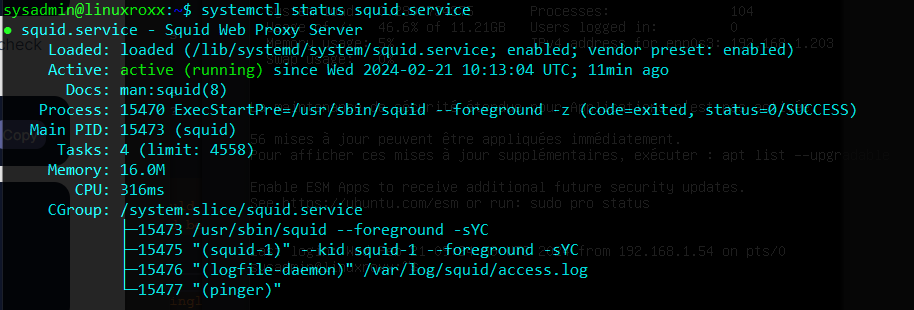
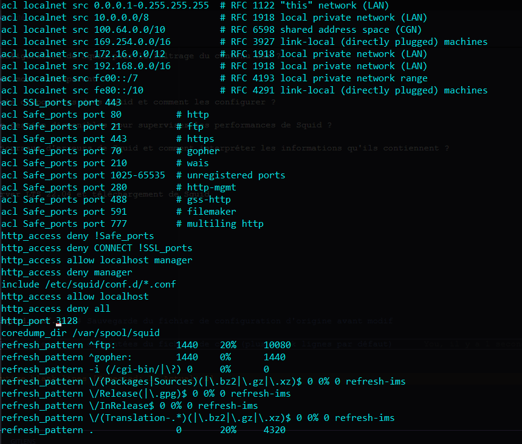
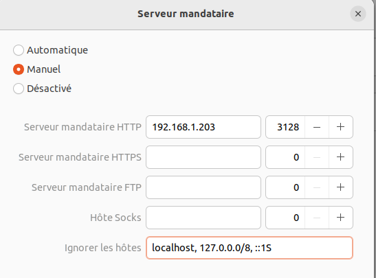
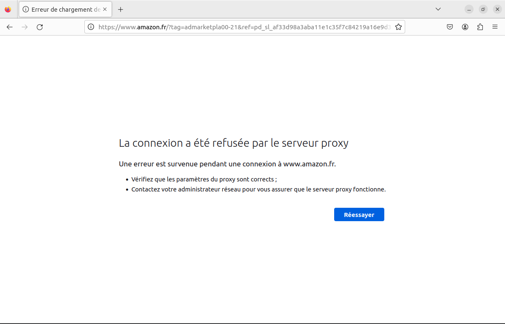
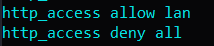
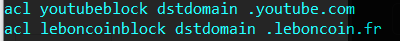

# Sauvegarde d'un ADDS

La PSSI de l'entreprise impose la sauvegarde journalière de l'ADDS, une solution de backup est de ce fait à mettre en place.

## Auteur

Roblot Jean-Philippe - <jroblot.simplon@proton.me>

## Version

19/02/2024 - V1R0

## Releases


Powered by <https://shields.io>

## Contexte

En tant que administrateur Système, mise en place d'une solution de backup pour ADDS afin d'avoir un plan de secours en cas de perte de ce dernier.

Il vous faudra :

- mettre en place un Serveur Windows 2019 et y activer un ADDS.

- Ajouter un domaine et y joindre un client.

- Créer un dossier partager avec l'ADDS, y pousser une iso windows.

- Mettre en place une planification de backup de votre ADDS complet, y compris le dossier partager et son comptenu.

## Matériel

Réseau Privé Hôte @ip 192.168.56.0/24

**Machine serveur**

- Windows Server 2019
- vCPU : 1 core
- vRAM 6Go
- vHDD : 50Go
- @ip : 192.168.56.254

**Machine client**

- Laptop Windows 10 Pro Version 22h2
- Nom :
- CPU : 1 core
- RAM 6Go
- SSD : 40Go
- @ip 192.168.56.99

## Etapes

1. Déployer un serveur Win2019 - ok
2. Lui attribuer une IP statique - ok 192.168.56.254
3. Y ajouter le rôle ADDS (et DNS) - ok
4. Le promouvoir contrôleur de domaine
   
5. Créer Une UO, un Groupe de sécurité "Collaborateur" et un utilisateur
   
6. Déployer une machine client Win 10
7. Joindre le domaine
8. Côté serveur, créé un dossier partagé
   
   
9. Côté client, y stocker une iso
   
10. Mettre en place une planification de backup de votre ADDS complet, y compris le dossier partager et son comptenu.
   
   
   
   

      ```PowerShell
         # Installer la fonctionalité avec PowerShell
         Install-WindowsFeature -Name Windows-Server-Backup
      ```

- Sauvegarder via CLI

   ```PowerShell
      wbadmin start backup -allCritical -backuptarget:\<Drive_letter_to_store_backup\>:
   ```

- Planifier en CLI

   - Identifier le disque cible
         

   - Exécuter le script

      ```PowerShell
         # Créer une nouvelle policy
         $policy = New-WBPolicy

         # Sélectionner les volumes à sauvegarder
         $volumes = Get-WBVolume -AllVolumes | where mountpath -eq "c:,d:"
         Add-WBVolume -Policy $policy -Volume $volumes

         # ajoute bare metal recovery, réduit les temps d'arrêt en cas de panne
         Add-WBBareMetalRecovery $Policy

         # Définir le disque de backup
         $disks = Get-WBDisk
         $backupLocation = New-WBBackupTarget -Disk $disks[1]
         Add-WBBackupTarget -Policy $policy -Target $backupLocation

         # Réaliser un état du système
         Add-WBSystemState -Policy $policy

         # Planification de l'heure pour effectuer des sauvegardes quotidiennes
         Set-WBSchedule -Policy $policy 22:00

         # Activer la policy
         Set-WBPolicy -Policy $policy
      ```

## Questions

- ​Quelles sont les étapes clés à suivre pour configurer une stratégie de sauvegarde pour un environnement AD DS ?

  - Installer la Sauvegarde Windows Server : La sauvegarde Windows Server n’est pas installée par défaut. Vous devez l’installer en suivant certaines étapes
  - Effectuer une sauvegarde avec la Sauvegarde Windows Server : Vous pouvez utiliser la Sauvegarde Windows Server pour effectuer une sauvegarde de récupération complète (BMR) de votre serveur
  - Planifier la sauvegarde : Vous pouvez configurer la Sauvegarde Windows Server pour effectuer des sauvegardes automatiques à des moments spécifiques. Cela peut être particulièrement utile pour garantir que les sauvegardes sont effectuées régulièrement

- Quels sont les éléments de l'Active Directory qu'il est essentiel de sauvegarder pour assurer une récupération efficace en cas de sinistre ? Quelle est la fréquence recommandée pour effectuer des sauvegardes de l'Active Directory ?

  - Contrôleurs de domaine : Il est recommandé de sauvegarder au moins deux contrôleurs de domaine pour assurer une haute disponibilité du service d’annuaire1.
  - Base de données Active Directory : Chaque contrôleur de domaine contient une copie de la base de données, il est donc crucial de la sauvegarder1.
  - Sauvegarde de récupération complète (BMR) : Une sauvegarde BMR est recommandée pour préparer une récupération de forêt, car elle peut être restaurée sur un autre matériel ou une autre instance de système d’exploitation

  Il est recommandé d'effectuer au moins une sauvegarde de l'AD par jour.

- Comment choisir un emplacement de sauvegarde approprié pour stocker les sauvegardes de l'AD DS ?

  A minima, un volume est nécessaire pour les données de volumes critiques et un autre pour la sauvegarde.  
   Idéalement, la sauvegarde doit être stocké sur un disque différent du disque système.  
   Il est possible d'effectuer une partage réseau.  
   Une sauvegarde externalisée (Azure par exemple), permet de pallier à un sinistre sur site.

- Quels outils ou logiciels de sauvegarde sont recommandés pour sauvegarder l'Active Directory et pourquoi ?

  - Sauvegarde Windows Serveur (Rôle et fonctionnalité)
  - wbadmin.exe via PowerShell ou l'invite de commande

  Il existe également Azure Backup pour une sauvegarde externalisée sur Azure, ou encore des outils tiers (Veeam, Nakivo, HornetSecurity).

- Quelles sont les étapes à suivre pour restaurer un domaine Active Directory à partir d'une sauvegarde en cas de défaillance critique ?

  - Restaurez les fichiers de démarrage : Ces fichiers sont essentiels pour le démarrage du système.
  - Restaurez SysVol : SysVol est un dossier partagé qui stocke les scripts de connexion du serveur et les objets de stratégie de groupe.
  - Restaurez le serveur de certificats (si applicable) : Si votre serveur Active Directory est également un serveur de certificats, vous devrez restaurer la base de données du serveur de certificats.
  - Restaurez la base de données de cluster (si applicable) : Si votre serveur Active Directory fait partie d’un cluster, vous devrez restaurer la base de données du cluster.
  - Restaurez la base de données d’inscription de classe COM+ (si applicable) : Si votre serveur utilise COM+, vous devrez restaurer sa base de données.
  - Restaurez le serveur Active Directory : C’est l’étape où vous restaurez la base de données Active Directory elle-même.
  - Restaurez le Registre : Le registre contient des informations de configuration importantes pour le système d’exploitation, les logiciels installés et le matériel du serveur

  La restauration de l'ADDS doit être effectuée hors connexion.

- Comment documenter et tenir à jour les procédures de sauvegarde et de restauration de l'Active Directory pour assurer une reprise rapide en cas d'urgence ?
  - Documentter les procédures, les tester et les mettre à jour.
  - Former l'équipe IT
  - Créer un PRA (Plan de Reprise d'Activité)
  - Utiliser des outils de gestion comme Veeam ONE pour surveiller les performances globales des sauvegardes, fournir des rapports, générer des alertes, et proposer des bonnes pratiques à implémenter
  - Réaliser des audits réguliers
