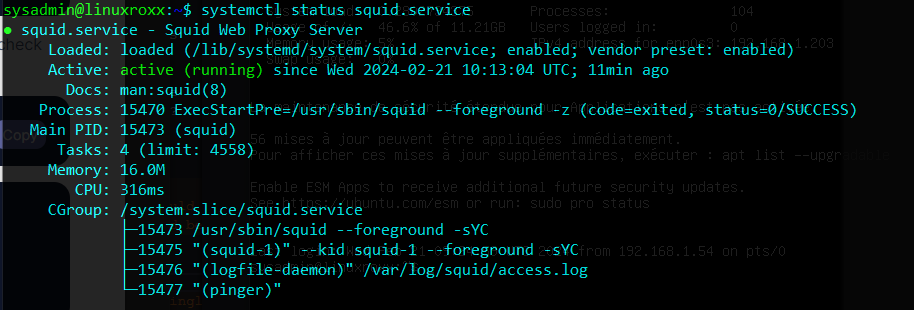

# Installation d'un serveur proxy

Dans le cadre de la mise aux normes de nos infrastructures il est demandé a l'équipe DSI de mettre en place un serveur proxy web pour l'ensemble de l'entreprise.

## Auteur

Roblot Jean-Philippe - <jroblot.simplon@proton.me>

## Version

21/02/2024 - V1R0

## Releases


Powered by <https://shields.io>

## Contexte

En tant que administrateur Système, il vous est demander de vous documenter et de mettre en place un proxy web sur l'infrastructure de votre entreprise afin de respecter la législation.

Afin de réaliser cela il vous est indiqué le souhait d'utiliser des technologies Opensource.En tant que administrateur Système, installation d'un proxy web dans l'infrastructure.

## Questions

1. Qu'est-ce que Squid et quel est son rôle dans une infrastructure réseau ?  
  C'est un proxy web qui permet de filtrer le traffic réseau et de garder en cache les pages web visitées afin de rendre a navigation plus rapide.  
  Il stocke également les logs du traffic réseau.

2. Quels sont les avantages de l'utilisation de Squid en tant que serveur proxy cache ?  
  Rendre la navigation plus rapide pour les paes déjà visitées.

3. Comment installer et configurer Squid sur un système Linux ?

4. Quelles sont les différentes méthodes de configuration de Squid pour le filtrage du contenu web ?

5. Comment configurer Squid pour fonctionner en mode transparent ?

6. Quels sont les mécanismes de contrôle d'accès disponibles dans Squid et comment les configurer ?

7. Quels sont les outils de surveillance et de gestion disponibles pour superviser les performances de Squid ?

8. Comment gérer les journaux d'accès et les journaux d'erreurs de Squid et comment interpréter les informations qu'ils contiennent ?

## Activités

1. Installation d'un serveur Linux, Ubuntu Server LTS 22.04 et téléchargement de Squid  
  ```bash
    sudo apt update && sudo apt upgrade

    sudo apt install squid
  ```
  