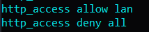
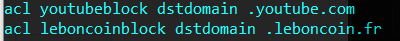
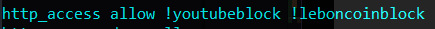
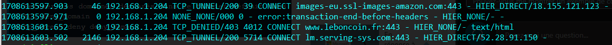

# Installation d'un serveur proxy

Dans le cadre de la mise aux normes de nos infrastructures il est demandé a l'équipe DSI de mettre en place un serveur proxy web pour l'ensemble de l'entreprise.

## Auteur

Roblot Jean-Philippe - <jroblot.simplon@proton.me>

## Version

21/02/2024 - V1R0

## Releases


Powered by <https://shields.io>

## Contexte

En tant que administrateur Système, il vous est demander de vous documenter et de mettre en place un proxy web sur l'infrastructure de votre entreprise afin de respecter la législation.

Afin de réaliser cela il vous est indiqué le souhait d'utiliser des technologies Opensource.En tant que administrateur Système, installation d'un proxy web dans l'infrastructure.

## Matériel

Réseau Privé Hôte @ip 192.168.56.0/24

**Machine serveur**

- Ubuntu Server LTS 22.04
- vCPU : 1 core
- vRAM 4Go
- vHDD : 25Go
- NIC 1 : @ip 192.168.1.203/24 par pont
- NIC 2 : @ip 2 : 192.168.1.202/24 en réseau interne

**Machine client**

- Laptop Ubuntu Desktop LTS 22.04
- CPU : 1 core
- RAM 4Go
- SSD : 25Go
- @ip 192.168.1.204

## Questions

1. Qu'est-ce que Squid et quel est son rôle dans une infrastructure réseau ?  
   C'est un proxy web qui permet de filtrer le traffic réseau et de garder en cache les pages web visitées afin de rendre a navigation plus rapide.  
   Il stocke également les logs du traffic réseau.

2. Quels sont les avantages de l'utilisation de Squid en tant que serveur proxy cache ?  
   Rendre la navigation plus rapide pour les paes déjà visitées.

3. Comment installer et configurer Squid sur un système Linux ?

   ```bash
   sudo apt install squid
   sudo nano /etc/sqid/squid.conf
   ```

4. Quelles sont les différentes méthodes de configuration de Squid pour le filtrage du contenu web ?

   - Filtrage par domaine: Vous pouvez bloquer l’accès à certains noms de domaine en utilisant les ACL (Access Control Lists) dans le fichier de configuration de Squid.
   - Filtrage par extension de fichier: Squid permet également de bloquer certaines extensions de fichiers.
   - Authentification des utilisateurs1: Vous pouvez demander aux utilisateurs de s’authentifier pour pouvoir accéder au proxy.
   - Utilisation de SquidGuard: SquidGuard est un plugin pour Squid qui permet d’effectuer du filtrage de sites Web basé sur des catégories, via une blacklist. Il permet également de mettre en place des règles en fonction de plages horaires, de groupes d’utilisateurs, etc.

5. Comment configurer Squid pour fonctionner en mode transparent ?

6. Quels sont les mécanismes de contrôle d'accès disponibles dans Squid et comment les configurer ?  
   Il y a deux choses principale à paramétrer :

   - Les ACL (Access Control List) qui sont des critères de contrôle d’accès qui seront ensuite utilisés par la directive http_access
   - Les HTTP_ACCESS, suivies de allow ou deny pour autoriser ou interdire l’accès au proxy-cache

7. Quels sont les outils de surveillance et de gestion disponibles pour superviser les performances de Squid ?

   - ManageEngine OpManager: C’est un outil proactif de surveillance des serveurs qui aide les organisations à surveiller et à gérer leurs serveurs de manière transparente. Il fournit un tableau de bord unique pour chaque serveur et permet aux administrateurs informatiques d’afficher l’utilisation du processeur, de la mémoire et du disque pour chaque occurrence de machine virtuelle invitée sur le serveur.
   - Site24x7: Il offre une planification de la maintenance et des rapports personnalisables.
   - Moniteur de serveur et d’application: Il offre une interface Web intégrée unique et une cartographie intelligente des dépendances infra des applications.
   - Meilleure pile: Il offre une interface intégrée unique, des tableaux de bord, livetail et des alertes exploitables illimitées

8. Comment gérer les journaux d'accès et les journaux d'erreurs de Squid et comment interpréter les informations qu'ils contiennent ?

   - Journaux d’accès : Ces journaux enregistrent toutes les requêtes traitées par Squid. Chaque ligne du journal d’accès correspond à une requête unique et contient des informations telles que l’heure de la requête, la durée de la transaction, l’adresse IP du client, le code d’état HTTP, la taille de la réponse, le type de requête (GET, POST, etc.), l’URL demandée, et plus encore.
   - Journaux d’erreurs : Ces journaux enregistrent les messages d’erreur générés par Squid. Ils sont utiles pour le dépannage et contiennent des informations sur les problèmes rencontrés par Squid lors de l’exécution.

   - Pour afficher les dernières entrées dans le journal d’accès :

     ```Bash
     tail /var/log/squid/access.log
     ```

   - Pour afficher les dernières entrées dans le journal d’erreurs :

     ```Bash
     tail /var/log/squid/cache.log
     ```

   - Pour vider un journal :

     ```Bash
     > /var/log/squid/access.log
     ```

## Activités

1. Installation d'un serveur Linux, Ubuntu Server LTS 22.04 et Squid

   ```bash
     sudo apt update && sudo apt upgrade

     sudo apt install squid
   ```

   

   ```bash
     sudo cp /etc/squid/squid.conf /etc/squid/squid.conf.bak # Sauvegarde du fichier de configuration d'origine avant modif

     sudo grep -vE '^#|^$' /etc/squid/squid.conf | sudo tee /etc/squid/squid.conf > /dev/null # Retire les ligne commentées du fichier de conf (plus de 9k lignes) par défaut)
   ```

   

2. A ce stade, notre proxy bloque tout le traffic internet par défault, et n'est pas en mode transparent. Ainsi, il nous faudra configurer le proxy côté client :
   
   

3. Autoriser l'accès au web pour notre réseau local  
     
   
   

4. Empêcher l'accès à certains domaines  
     
     
   

- Affichage des log

  ```bash
  sudo cat /var/log/squid/access.log
  ```

  
  TCP_TUNNEL pour Amazon qui est autorisé  
  TCP_DENIED pour Leboncoin est bloqué

- Nous allons maintenant passer notre proxy en mode transparent, ce qui offre l'avantage de rediriger automatiquement le traffic vers ce dernier sans avoir à paramétrer le poste client.
  
