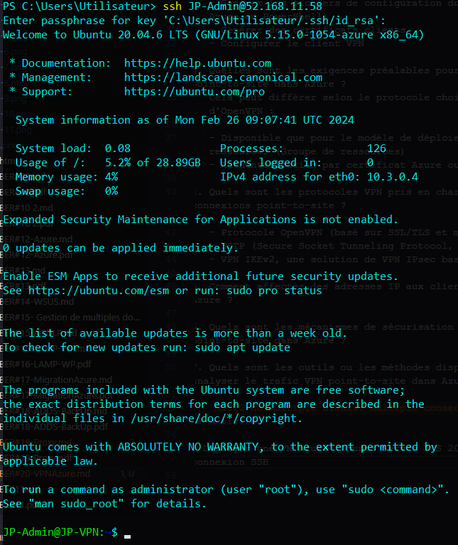
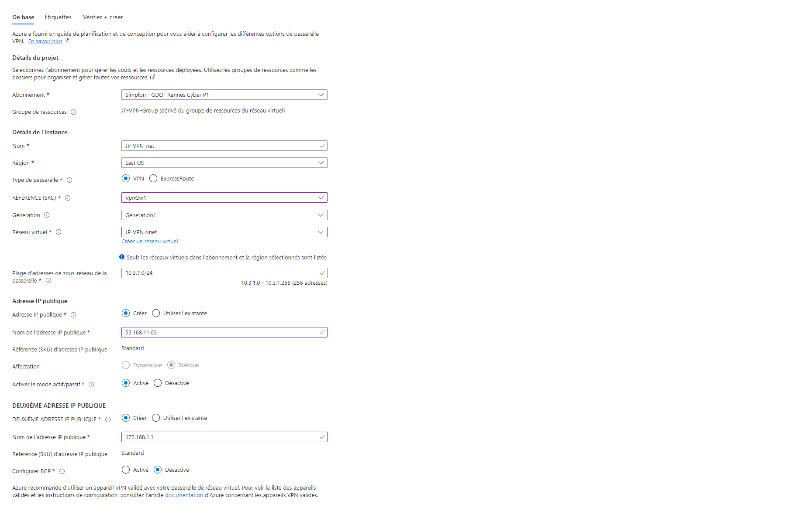
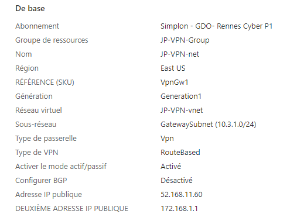
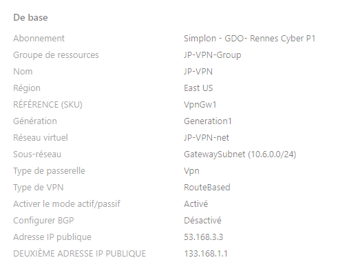
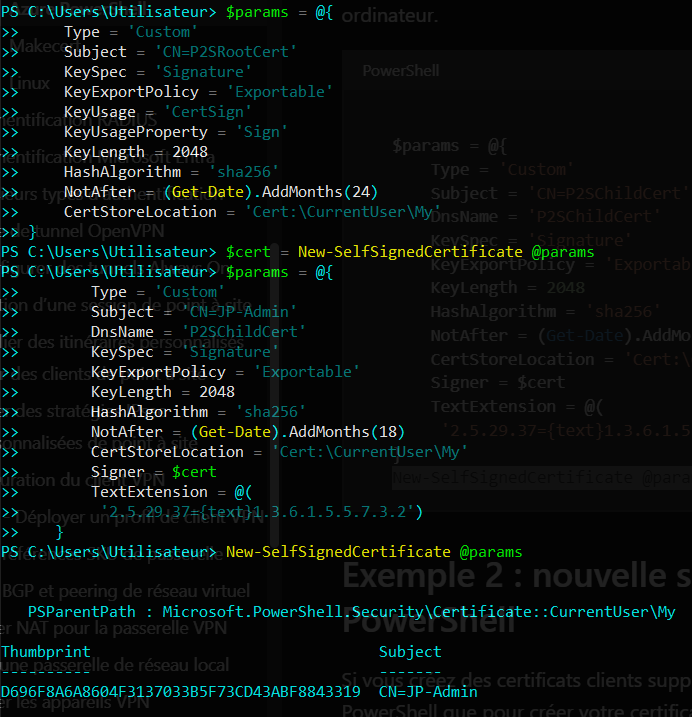
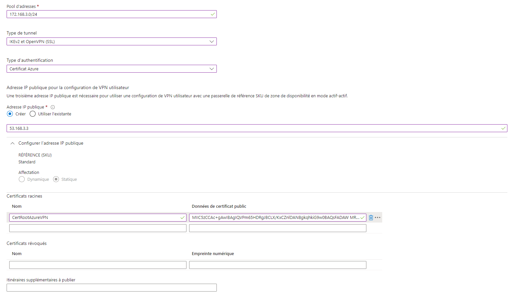

# Sécurisation des Flux par VPN

Dans le cadre de l'évolution de votre infrastructure et son externalisation il est nécessaire de mettre en place un VPN afin de gérer de façon sécurisé vos serveurs.

## Auteur

Roblot Jean-Philippe - <jroblot.simplon@proton.me>

## Version

21/02/2024 - V1R0

## Releases

Powered by <https://shields.io>

## Contexte

En tant qu'administrateur réseau il vous est demandé de sécuriser l'accés a votre infrastructure se trouvant dans Azure par la mise en place d'un VPN dans Azure.

## Questions

1. Qu'est-ce qu'un VPN point-to-site et comment cela diffère-t-il d'autres types de VPN ?  
   UN VPN point-to-site permet de se connecter à un réseau depuis n'importe quel réseau (généralement un connexion internet publique), contrairement à un VPN site-to-site qui ne permet de se connecter que depuis un autre LAN approuvé.
2. Quelles sont les étapes pour configurer un VPN point-to-site dans Azure ?

   - Générer les fichiers de configuration du client VPN (via le portail Azure ou PowerShell)
   - Générer des certificats clients
   - Configurer le client VPN

3. Quelles sont les exigences préalables pour configurer un VPN point-to-site dans Azure ?
   Cela peut différer selon le protocole choisi. Pour l'exemple d'OpenVPN :

   - Disponible que pour le modèle de déploiemetn du Gestionnaire de ressources (Groupe de ressources)
   - Authentification par certificat Azure ou Entra ID

4. Quels sont les protocoles VPN pris en charge par Azure pour les connexions point-to-site ?

   - Protocole OpenVPN (basé sur SSL/TLS et multiplateformes)
   - SSTP (Secure Socket Tunneling Protocol, propriétaire, Windows only)
   - VPN IKEv2, une solution de VPN IPsec basée sur des normes.

5. Comment affecter des adresses IP aux clients VPN point-to-site dans Azure ?

6. Quels sont les mécanismes de sécurisation des connexions VPN point-to-site dans Azure ?

7. Quels sont les outils ou les méthodes disponibles pour surveiller et analyser le trafic VPN point-to-site dans Azure ?

## Activités

- Déployer une VM Azure (Ubuntu Server LTS 20.04, "JP-Admin") avec connexion SSH
    
   A ce stade, nous administtrons notre VM via SSH sur son IP publique. Nous souhaitons mettre en place un VPN afin de se connecter de façon sécurisée à son IP privée.

- Créer une passerelle de réseau virtuel
  
  
  

- Générer un certificat racine autosigné et un certificat client
   

- Configuration de P2S
   

   Motdepasseaupif@ Flo-Chacha-JP