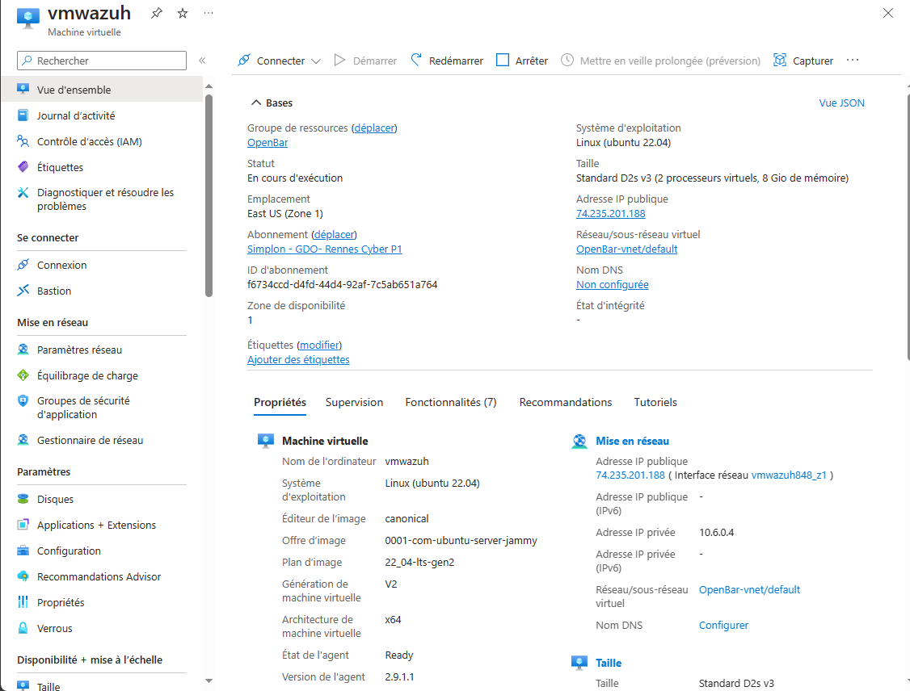
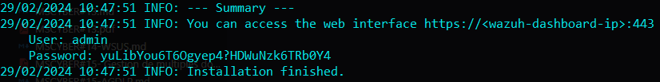
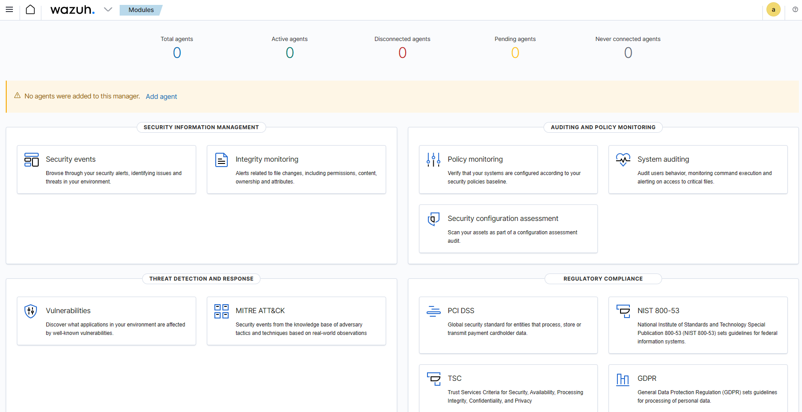
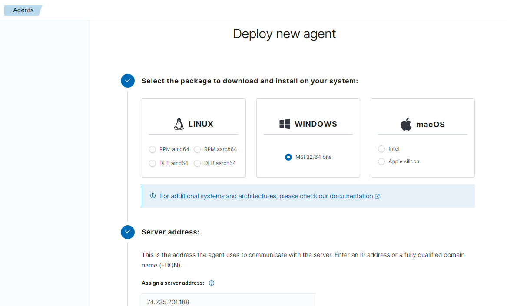
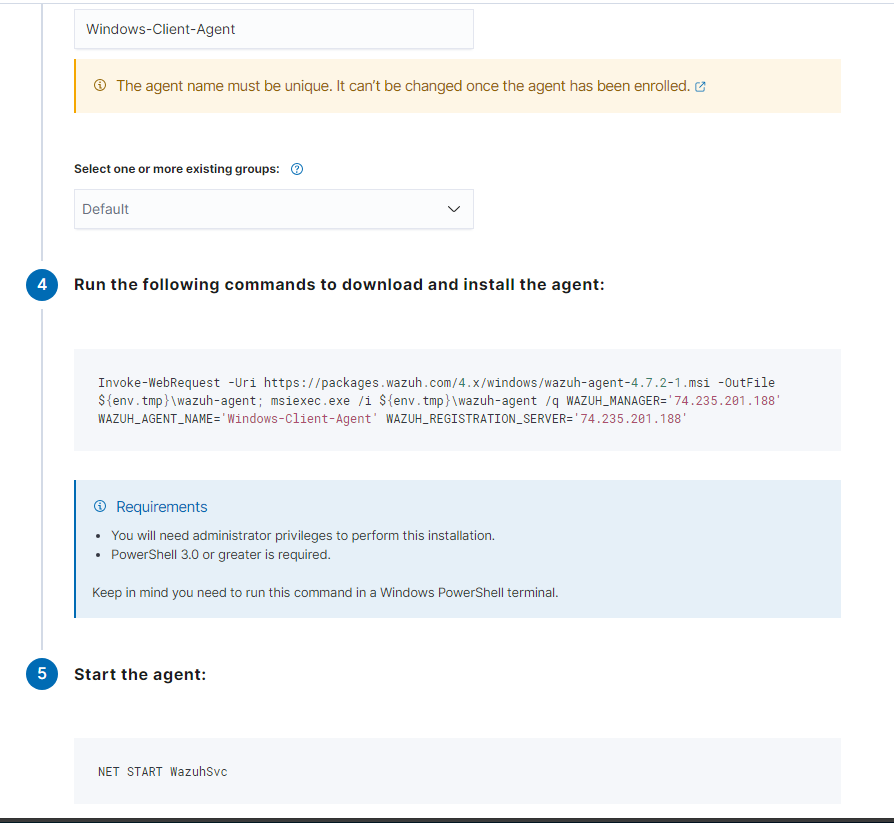

# Sécurisation des Flux par VPN

Dans le cadre de la sécurisation de vos infrastructures il vous est demandé de pouvoir anticipé et agir en cas de soucis.

## Auteur

Roblot Jean-Philippe - <jroblot.simplon@proton.me>

## Version

29/02/2024 - V1R0

## Releases


Powered by <https://shields.io>

## Contexte

En tant que administrateur Cybersécurité, mise en place d'un serveur EDR et ajout d'agent sur les serveurs et clients de l'infrastructure.

## Questions

1. Qu'est-ce que l'Endpoint Detection and Response (EDR) et quel est le rôle de Wazuh dans ce domaine ?

   Les solutions de sécurité EDR peuvent détecter les comportements suspects du système sur les hôtes et les terminaux, collecter des données sur les points de terminaison et analyser les événements individuels, puis enquêter sur la cause première du comportement malveillant. Leurs princiaples fonctions :

   - Détection automatisée des cybermenaces
   - Intégration de la Threat Intelligence
   - Surveillance continue en temps réel et visibilité historique
   - Enquête rapide sur les menaces

   Wazuh se compose de différents composants :

   - Les agents Wazuh, déployés sur les hôtes à surveiller, collectant des données sur les activités du système et des journaux pour les analyser et détecter les comportements suspects ou les signes d’intrusion.
   - Le serveur Wazuh, qui agit comme un centre de contrôle, recevant et analysant les données des agents. Le serveur Wazuh est l’élément central où se déroule la corrélation des événements, la détection d’anomalies et la réponse aux incidents.
   - Interface utilisateur (UI) et API : Pour la gestion et la visualisation des données, l’interface utilisateur offre des tableaux de bord, des alertes et des rapports. L’API permet l’intégration avec d’autres outils et systèmes existants.

   Ses fonctionnalités :

   - Détection des menaces :
   - Analyse des journaux
   - Conformité et gestion des vulnérabilités
   - Réponse aux incidents

2. Quels sont les principaux avantages de l'utilisation de Wazuh comme solution EDR pour la détection et la réponse aux menaces sur les endpoints ?

   - Open Source : Étant une solution open source, Wazuh est accessible à tous, favorisant la transparence et permettant à la communauté de contribuer à son développement.

   - Flexibilité et extensibilité : Wazuh peut s’intégrer à d’autres outils et solutions de sécurité, offrant ainsi une plus grande flexibilité pour répondre aux besoins spécifiques de chaque environnement.

   - Surveillance centralisée : Avec un serveur central, il est possible de surveiller et de gérer un grand nombre d’agents, ce qui en fait une solution adaptable aux réseaux de toute taille.

   - Corrélation avancée des événements : La capacité de corréler les événements à partir de multiples sources permet une détection plus précise des menaces.

3. Quels sont les prérequis matériels et logiciels nécessaires pour déployer Wazuh en tant que solution EDR ?

    - Matériel :
      - 2 coeurs CPU, 4Go de RAM et 3Go de stockage pour le serveur (ou plus selon le nombre d'agents)
    - Logiciels
      - Navigateur : Chrome 95 or later, Firefox 93 or later, Safari 13.7 or later
      - L'agent est pris en charge pour Linux, Windows, MacOS, Docker et Kubernetes

4. Comment configurer les agents Wazuh sur les endpoints et quels types de données sont collectés pour l'analyse ?  

    La configuration des agents est centralisée via le fichier `agent.conf`.  
    Sont paramétrables à distance :
      - Surveillance de l’Intégrité des Fichiers (syscheck) : Vérifie les modifications de fichiers sur les points d’extrémité.
      - Détection de Rootkits (rootcheck) : Identifie les rootkits et les comportements suspects.
      - Collecte de Données de Journal (localfile) : Collecte les journaux système et d’application.
      - Surveillance des Politiques de Sécurité (wodle name=“open-scap”, wodle name=“cis-cat”) : Vérifie la conformité aux politiques de sécurité.
      - Commandes à Distance (wodle name=“command”) : Permet d’exécuter des commandes à distance sur les agents.
      - Étiquettes pour les Alertes des Agents (labels) : Ajoute des étiquettes aux alertes générées par les agents.
      - Évaluation de la Configuration de Sécurité (sca) : Évalue la configuration de sécurité des points d’extrémité.
      - Inventaire Système (syscollector) : Collecte des informations sur les logiciels installés, les utilisateurs, etc.
      - Éviter les Inondations d’Événements (client_buffer) : Gère le flux d’événements.
      - Configuration osquery (wodle name=“osquery”) : Intègre osquery pour collecter des données supplémentaires.
      - Intervalle de Reconnexion Forcée (client) : Configure l’intervalle de reconnexion forcée des agents.

5. Quels sont les mécanismes de détection de Wazuh pour identifier les menaces et les comportements suspects sur les endpoints ?  

    Wazuh utilise des règles, des analyses de vulnérabilités et des mécanismes de surveillance pour identifier les menaces et les comportements anormaux sur les points d’extrémité, renforçant ainsi la sécurité globale du réseau.

6. Comment configurer des alertes dans Wazuh pour être informé en temps réel des activités malveillantes sur les endpoints ?  

    On peut générer des alertes via les règles de détection des menaces prédéfinies de Wazuh, en créant des règles personalisées et via la surveillance de l'intégriter des fichiers (FIM).  
    L'intégration avec VirusTotal et Yara renforce la capacité de Wazuh à identifier les menaces.

## Déploiement du serveur Zabbix

- Déployer une VM Ubuntu Server LTS 22.04 (dans notre cas dans Azure)

  

- Installer W.Indexer, W.Server, W.Dashboard

  ```bash
  curl -sO https://packages.wazuh.com/4.7/wazuh-install.sh && sudo bash ./wazuh-install.sh -a
  ```

  
  

- Via le naviateur, se connecter au dashboard avec les identifiants fournis lors de l'installation

  

- Le manager utiliser les ports 1514 et 1515 pour récupérer les données des agents. Ils faut donc ouvrir les ports du serveur

  

## Ajouter l'agent pour Windows

- **Via PowerShell**  
  Dans le portail Wazuh, cliquer sur "add an agent"

  
  

- **Via GUI**
  - Télécharger l'installer sur le poste client via [le site officiel](https://packages.wazuh.com/4.x/windows/wazuh-agent-4.7.2-1.msi)
  - Lancer l'assistant d'installation
  
    

## Ajouter l'agent pour Linux

- Procéder de la même façon que précédemment sur le portail Wazuh, spécifier l'agent correspondant à votre distribution (ici DEB amd64)

```bash
wget https://packages.wazuh.com/4.x/apt/pool/main/w/wazuh-agent/wazuh-agent_4.7.2-1_amd64.deb && sudo WAZUH_MANAGER='74.235.201.188' WAZUH_AGENT_NAME='ubuntu' dpkg -i ./wazuh-agent_4.7.2-1_amd64.deb

sudo systemctl daemon-reload
sudo systemctl enable wazuh-agent
sudo systemctl start wazuh-agent
```

## Visualiser nos agents

  

## Retirer un agent de la liste

- Sur le serveur Wazuh

  